# ELB

## Learning Objectives:
  - Broadly describe the High Throughput Sequencing Workflow
  - Interpret and Manipulate raw sequencing data
  - Align HTS data against a genome
  - Visualize alignments
  - Broadly describe different HTS applications
 
## Learning Outcomes:

  - [**1**: Broadly describe the High Throughput Sequencing Workflow](#LO1)

  - [**2**: Interpret and Manipulate raw sequencing data](#LO2)
    + [**2.1**: The FastQ file format](#LO2.1)
    + [**2.2**: Use FastQC to analyse the quality of data in a fastq file](#LO2.2)
    + [**2.3**: Use Trimmomatic to improve the quality of data in a fastq file](#LO2.3)

  - [**3**: Align HTS data against a genome](#LO3)
    + [**3.1**: Use the BWA aligner to align HTS data against a genome](#LO3.1)
    + [**3.2**: The SAM/BAM alignment format](#LO3.2)

  - [**4**: Visualize alignments](#LO4)
    + [**4.1**: Use Qualimap to assess quality of alignments](#LO4.1)  
    + [**4.2**:Use IGV to visualize the content of a BAM file](#LO4.2)

  - [**5**: Broadly describe different HTS applications](#LO5)
    + [**5.1**: Variant detection in resequencing experiments](#LO5.1)
    + [**5.2**: Denovo genome assembly and annotation](#LO5.2)
    + [**5.3**: Transcriptomics using RNA-Seq](#LO5.3)
    + [**5.4**: 16S Metagenomics](#LO5.4)
    + [**5.5**: Epigenetics](#LO5.5)

**NOTE**: At the end of each of the sections regarding particular learning outcomes, we will ask you how confident you feel about having achieved that specific learning outcome. Therefore, to synchronize everyone, we will ask you to turn on the green light you have in your workstation once you've finished doing all the activities for that section. Don't hesitate to ask questions and to turn on the red light if you're having issues at any point while you're performing the activities.	
	
## <a id="LO1">1 - The High Throughput Sequencing Workflow</a>

[Sanger sequencing](https://en.wikipedia.org/wiki/Sanger_sequencing) brought about a technological revolution, as it allowed to directly read DNA molecules with relative ease and affordability. The [Human Genome Project](https://en.wikipedia.org/wiki/Human_Genome_Project) motivated further progress, leading to automated DNA-sequencing machines capable of sequencing up to 384 samples in a single batch using capillary electrophoresis. 

At the moment, the high throughput sequencing technology most often used (by far) is Illumina. Similarly to the Sanger method, it is also based on the addition of nucleotides specifically modified to block DNA strand elongation, where each nucleotide is marked with a different color. Unlike the Sanger method, where a single DNA molecule is "read" at a time, modern illumina machines allow reading up to millions of DNA molecules simultaneously.  

The following links are a good source of information regarding this sequencing technology:
* [Illumina Sequencing by Synthesis](https://www.youtube.com/watch?&v=fCd6B5HRaZ8).
* [Elaine Mardis talk on NGS](https://www.youtube.com/watch?v=v1DbcJD4Ry0).

**QUESTION**: Can you broadly describe commmon steps in most high throughput sequencing workflows?

Click Here to see the answer

  * Extraction and purification of the DNA template (even RNA must usually be converted to cDNA)
  
  * Fragmentation of the DNA template (into a size range that can be accommodated by the machine)
  
  * Attachment of sequencing tags (to enable reading by the machine)
  
  * Amplification of signal (usually trough PCR, often already in the machine)
  
  * Reading of signal and conversion into nucleotide bases
  

 
 

## <a id="LO2">2 - Interpret and Manipulate raw sequencing data</a>

### <a id="LO2.1">2.1 - The FastQ file format</a>

Results of sanger sequencing are usually fasta files (obtained from processing chromatograms). Most high-throughput sequencing machines output [fastq files](https://en.wikipedia.org/wiki/FASTQ_format), the “de facto” current standard in HTS. Like fasta, fastq files are simply text files, but where each block of information (a sequenced DNA fragment, or read) in this format is encoded as 4 lines:

	@read_identifier
	read_sequence
	+ separator line
	base_qualities
	
For example, here you have 8 lines of a fastq file, corresponding to 2 sequences:

	@HWI-M01876:76:000000000-AF16W:1:1101:10853:1000 1:N:0:CGTGACAGAT
	NTGTACTTCATCCGAAACTCGTGCTCATCTCTGCTCAGATCGGAAGAGCACACGTCTGAACTCCAGTCACCGTGAT
	+
	#8ABCFGGGFCEDCFGGGGGGGFFCGEFGGGGGGFGGGGGGGGDEFGGGGGGGGGGGGGGGGGFFFEGGGGGGGGF
	@HWI-M01876:76:000000000-AF16W:1:1101:16471:1000 1:N:0:CGTGAACTTG
	NTTCCAGATATTCGATGCATGTGCCGCTCCTGTCGGAGATCGGAAGAGCACACGTCTGAACTCCAGTCACCGTGAT
	+
	#8BCCGGGGGGGGGGGGGGGGGGGGGGGGGGGGGGGGGGGGGGGEGGGGFGGGGGGGGGGGGGGGGGGGGGGGGGG

Each base has a quality character associated with it, representing how confidently the machine identified (called) the base. The probability of error per base is given as a [Phred score](https://en.wikipedia.org/wiki/Phred_quality_score), calculated from an integer value (Q) derived from the quality character associated to the base. The probability of error is given by the Phred score using P(Q)=10^(-Q/10). Useful reference values of Q include:
* Q=10 - 90% accuracy (0.1 error)
* Q=20 - 99% accuracy (0.01 error)
* Q=30 - 99.9% accuracy (0.001 error)
* Q=40 - 99.99% accuracy (0.0001 error)

Although there's theoretically no limit, Q usually goes up to around 40 in recent illumina machines.

To obtain this Q value from the character associated to the quality of the base, we have to know that each character (such as '#') has an [ASCII](https://en.wikipedia.org/wiki/ASCII) decimal value associated (for example, '#' has a value of 35). The Q value of a character is the decimal value corresponding to the entry of that character in the ASCII table, subtracted by 33. For example Q('#') = 35 – 33.

**NOTE**: To understand why we need to subtract 33, we have to look into the ASCII table below. We can see that the first visible character ('!') has decimal value 33. This allows visual inspection of qualities.

Looking at the first read of our fastq example, we can see it starts with 'N' (unknown), with an associated quality character '#'. To known how confident the machine was in reading that base, we calculate:
- Q = 35 (ASCII decimal value of '#') - 33 (ASCII decimal value of '!') = 2
- p(2) = 10^(-2/10) = 63% (probability of error)

Given this probability of error, it is not surprising that the machine could not confidently say which base was in that position, and therefore placed an 'N' in that position. It is fairly common that in the first bases the machine is still calibrating, and sometimes there is less confidence in the called base.

**TASK**: Calculate the probability of error of the bases of the following read in the fastq format:

	@SRR022885.1 BI:080102_SL-XAR_0001_FC201E9AAXX:6:1:752:593/1
	CGTACCAATTATTCAACGTCGCCAGTTGCTTCATGT
	+
	IIIIIIIIII>IIIIIII@IIII.I+I>35I0I&+/

**NOTE**: Phred+33 (Sanger fastq) is the current standard format. Nonetheless, with older illumina data (before 2009) preferred to start at the character '@' (ASCII: 64) instead of '!'. This Phred+64 format is the old illumina fastq. Some tools (like FastQC) can infer the format, while in others you need to specify.

**QUESTION**: What is the probability of error of the first base of the read?

Click Here to see the answer

The base quality character is 'I', which corresponds to the decimal 73 in the ASCII table. Q = 73-33 = 40. P(40) = 10^(-40/10) = 10^-4 = 0.01% error.

 

**QUESTION**: What is the probability of error of the last base of the read?

Click Here to see the answer

The base quality character is '/', which corresponds to the decimal 47 in the ASCII table. Q = 47-33 = 14. P(14) = 10^(-14/10) = 10^-4 ~= 4% error.

 

**QUESTION**: If all bases of a ficticious machine had a Q=20 (1% probability of error), what would be the probability that one 100bp read from that machine would be completely correct?

Click Here to see the answer

P(correct)=(0.99)^100 ~= 36.6%!

This serves to exemplify that most reads in current sequencing machines are likely to have at least one base incorrect.

 

Many sequencing machines can read both ends of a fragment. In this case, the machine will generate two **paired** fastq files, one with the forward reads and another with the reverse reads. You can find an example of this is the example fastq files paired_end_example_1 (containing the forward reads) and paired_end_example_2 (containing the reverse reads). These fastq are paired because the reads for the same fragment are in the same order in the two files. For example, the first read in the forward fastq correponds to the forward reading of the same fragment as the first read in the reverse fastq.

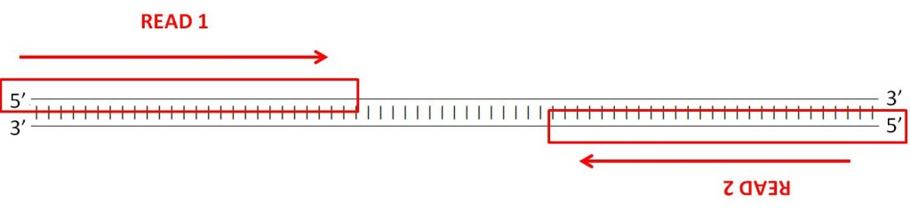

**QUESTION**: Inside the folder fastq_examples you can see several compressed fastq files. Uncompress the fastq files paired_end_example_1.fastq.gz and paired_end_example_2.fastq.gz that are in the folder fastq_examples (either by clicking on the files, or using gunzip on the command line). Open the uncompressed fastq files using any text editor (eg. kate). Can you see a relationship betweem the reads in both files?

Click Here to see the answer

The read identifiers are the same, in the same order (though the sequences are not). This is because they are readings of the same fragment, one (_1) in the forward and another (_2) in the reverse direction. Often the indication of forward and reverse is in the identifier itself.

 
 

**NOTE**: Turn on the green light when you're finished. Assess how well you achieved the learning outcome. For this, see how well you responded to the different questions during the activities and also make the following questions to yourself.

* How well do you understand the content of a fastQ file?

* Can you manually calculate the probability of error associated to any given base in a fastq file?

* Did you understand the difference between single-end and paired-end reads?
 
 

### <a id="LO2.2">2.2 - Quality Check of FastQ data</a>

High Throughput Sequencing machines read thousands or millions of sequences in parallel. As you can imagine, this usually generates large fastq files, with millions of lines. Manually inspecting the quality of each read is out of the question. Specialized software has been developed to provide quality measures for fastq files generated by HTS machines. [FastQC](http://www.bioinformatics.babraham.ac.uk/projects/fastqc/) is a popular program to generate quality reports on fastq data. In fact, this is usually the first thing you should do once you receive a new dataset. FastQC reports provide a series of plots that allow the user to assess the overall quality of their raw data and detect potential biases and problems. 

Some plots indicate distribution of base qualities along the length of reads. At least for illumina data, on average the quality of each base tends to decrease along the length of the read. 

 

Other plots indicate biases in nucleotidic content of reads, either globally (such as %GC plots), or positionally. Global bias in nucleotidic content can be useful to search for signs of contaminants. On the other hand, positional bias are useful to detect presence of artefactual sequences in your reads such as adaptors. Another insight you may obtain from this information are potential biases in the preparation of your library. For example, random hexamer priming is actually not truly random, and preferentially selects certain sequences. The currently popular transposase-based enzymatic protocol, although reasonably random, is also not completely random, and you can see this through positional bias, particularly in the beginning of reads. The presence of adaptors is a relatively common event, and therefore specific plots exist to detect the presence of the most commonly used adaptors. Finally, the presence of repetitive sequences can also suggest contaminants, pcr artifacts, or other types of bias.

 

**NOTE**: Given the size of fastq files (usually in the order of Gb), they are most frequently compressed as fastq.gz files. In fact, most tools (such as FastQC) work directly with fastq.gz to reduce space.

**TASK**: Open a terminal. type 'fastqc' and press enter. The graphical interface of FastQC should appear. Open the file MiSeq_76bp.fastq.gz inside of the folder fastq_examples. Look at the different plots you obtained. Next, open the file MiSeq_250bp.fastq.gz. Press the green button when you ran FastQC on both cases.

**QUESTION**: What information is in a FastQC report?

Click Here to see the answer

A FastQC report includes, among other things:  

  * Basic statistics of the fastq file, including number of reads and sequence length
  
  * Per base sequence quality, displaying the boxplot distribution of the Phred Quality (Q) per base for all reads.
  
  * Per sequence quality scores displaying the histogram of the mean quality (Q value) of the bases of each read, for all reads
  
  * Per base sequence content, displaying the frequency of each nucleotide at each position of the read
  
  * Per sequence GC content displaying the histogram of the GC frequency of each read, for all reads
  
  * Sequence length distribution displaying the histogram of read lengths
  
  * Sequence duplication levels displaying the histograms of the number of times reads appear with exactly the same sequence
  
  * Overrepresented sequences (not necessarily complete reads) that appear more frequently than randomly expected
  
  * Adapter content indicaring the frequency of sequences of know sequencing adaptors along the length of the reads
  

 

**QUESTION**: What are the main differences between the reports of both fastq files?

Click Here to see the answer

The MiSeq_250bp fastq file contains 10000 reads of 250bp, while the MiSeq_76bp contains 1000 reads of 76bp. The MiSeq_250bp reads have a lower per base sequence quality at their end, while the reads of the MiSeq_76bp keep a good quality throughout. The MiSeq_76bp reads contain a very noticeable nucleotide positional bias particularly after position 36. MiSeq_250bp also contain a bit of nucleotide positional bias, but less and only for the first 10bp. The MiSeq_250bp reads display an apparently bimodal GC distribution, while the MiSeq_76bp reads seem closer to a single normal distribution. Finally, MiSeq_76bp contain a clear presence of a known Illumina adaptor after position 36 (probably the reason for the nucleotide positional bias we saw before), while MiSeq_250bp contain a much smaller frequency of another Illumina adaptor towards the ends of the reads.

 

**TASK**: In a terminal window, go to the folder fastq_examples. Type 'fastqc *.fastq.gz' and press enter. 

**QUESTION**: Can you see differences between the different sequencing technologies?

Click Here to see the answer

Illumina machines generate shorter reads, all with the same length. Pacbio and nanopore generate (much) longer reads, with diverse read lengths, and of a poorer quality. Illumina generates many more reads, making both technologies complementary to each other (this will become clearer when we look at specific applications). Finally, you can also notice that, independently of the technology, the quality of base quality tends to decrease along the length of the read.

 

**QUESTION**: What is the major difference between the two paired fastq files of the paired_example?

Click Here to see the answer

The reverse read has poorer quality bases. This is usually the case, at least for illumina. This is because the reverse reads are generated after the forward reads.

 
 
 

**NOTE**: Turn on the green light when you're finished. Assess how well you achieve the learning outcome. For this, see how well you responded to the different questions during the activities and also make the following questions to yourself.

* Could you run FastQC on a fastq file?

* Can you broadly list types of information that a FastQC report contains?

* Can you interpret information in a FastQC report to detect potential issues with data in a fastq file?
 
 

### <a id="LO2.3">2.3 - Filtering and Trimming</a>

As you may have noticed before, reads tend to lose quality towards their end, where there is a higher probability of erroneous bases being called. To avoid problems in subsequent analysis, you should remove bases with higher probability of error, usually by trimming poor quality bases from the end.

**TASK**: Manually remove the bases with Q<30 from the 3' end of the read you analysed before.

	@SRR022885.1 BI:080102_SL-XAR_0001_FC201E9AAXX:6:1:752:593/1
	CGTACCAATTATTCAACGTCGCCAGTTGCTTCATGT
	+
	IIIIIIIIII>IIIIIII@IIII.I+I>35I0I&+/

**QUESTION**: How is the read after this trimming operation?

Click Here to see the answer

	@SRR022885.1 BI:080102_SL-XAR_0001_FC201E9AAXX:6:1:752:593/1
	CGTACCAATTATTCAACGTCGCCAGTTGCTTCA
	+
	IIIIIIIIII>IIIIIII@IIII.I+I>35I0I

 

**QUESTION**: Did you remove all lower quality bases from the read? What other strategies you can imagine to filter your reads?

Click Here to see the answer

	* No. There are still low quality bases in the read (NOTE: this does not mean the base is wrong, just that it is more likely to be wrong). 
	
	* Instead of looking only at the last base, one can look at the mean quality of the k (eg. k=4) last bases to decide if a base should be removed or not. Another alternative that is often used is to find the longest continuous stretch of bases with a quality above a certain value.
	

 

**QUESTION**: Can you remove bases in the middle of reads? Why?

Click Here to see the answer

	**NO!** Because you would be making artificial deletions in the sequence.

 
	
Like you have FastQC to automatically produce plots from fastq files, you also have software to filter low quality bases from fastq files. [Seqtk](https://github.com/lh3/seqtk) is a very simple tool that you can use to perform this filtering. 

**TASK**: In a terminal, go to folder fastq_examples. Type 'seqtk trimfq -q 0.01 MiSeq_250bp.fastq.gz > MiSeq_250bp.trimmed.fastq'. 

**QUESTION**: What is this command doing? Use fastQC to check the new fastq file that is created by this command. 

Click Here to see the answer

	Seqtk removes bad quality bases from the ends of reads. In this case, it removes bases with a probability of error greater than 1% (0.01), corresponding to Q<20.

 

Most software for the analysis of HTS data is freely available to users. Nonetheless, they often require the use of the command line in a Unix-like environment (seqtk is one such case). User-friendly desktop software such as [CLC](https://www.qiagenbioinformatics.com/products/clc-genomics-workbench/) or [Ugene](http://ugene.net/) is available, but given the quick pace of developmpent in this area, they are constantly outdated. Moreover, even with better algorithms, HTS analysis must often be run in external servers due to the heavy computational requirements. One popular tool is [Galaxy](https://galaxyproject.org/), which allows even non-expert users to execute many different HTS analysis programs through a simple web interface.

**TASK**: Let's use Galaxy to run some bioinformatic tools. Open the web browser (eg. Firefox). Type [localhost:8080](localhost:8080) in the URL tab (where you put the web addresses). This means that you are accessing a galaxy instance that is running on your local machine. You should see the Galaxy interface on your web browser. Click on the upload icon on the top left of the interface. Upload into Galaxy the files MiSeq_76bp.fastq.gz and MiSeq_250bp.fastq.gz. You should now seem them on your history in the right panel. You can visualize their content by pressing the view data icon (the eye icon). After you have your data, you're ready to run some tools on your data. The tools are listed on the left panel. Search for fastqc on the tool search bar on the left panel. By clicking on the tool you should have in the middle the interface to run fastQC. To run fastc you just need to select the fastq file and press "Execute". Run fastqc on the fastq files you uploaded and see the result. Still in galaxy again, search for and run "seqtk trimfq" on the file MiSeq_250bp.fastq with the same parameters as you used in the command line. 

As we saw before, sequencing machines (namely, the illumina ones) require that you add specific sequences (adaptors) to your DNA so that it can be sequenced. For many different reasons, such sequences may end up in your read, and you need to remove these artifacts from your sequences.

**QUESTION**: How can adaptors appear in your sequences? Take the sample MiSeq_76bp.fastq.gz as an example. 

Click Here to see the answer

	When the fragment being read is smaller than the number of bases the sequencing machine reads, then it will start reading the bases of the adaptor that is attached to all fragments so they can be read by the machines. In the case of MiSeq_76bp, the fragments were all 36bp, and since 76bp were being read, the remaining bases belong to the illumina adaptor that was used.

 

There are many programs to remove adaptors from your sequences, such as [cutadapt](https://cutadapt.readthedocs.org/en/stable/). To use them you need to know the adaptors that were used in your library preparation (eg. Illumina TruSeq). For this you need to ask the sequencing center that generated your data.

**TASK**: In Galaxy, use cutadapt to remove adaptors from MiSeq_76bp.fastq.gz. In this sample, we know that we used the illumina adaptor GTGACTGGAGTTCAGACGTGTGCTCTTCCGATCT, so try to remove this from the 3' end of reads and see the impact of the procedure using FastQC. For this, you need to insert a new adapter in 3', and in the source, select "Enter a custom sequence" (you don't need to add a name, just paste the sequence). 

**QUESTION**: What happened? To answer, look at the report from cutadapt, and use FastQC on the fastq that is output by cutadapt. 

Click Here to see the answer

	Almost no read was affected. This is because what you get is a readthrough, so what is actually in the read is the reverse complement of the adaptor. Now, try the same procedure but with AGATCGGAAGAGCACACGTCTGAACTCCAGTCAC (reverse complement of the previous). This time, most reads should have had the adaptor removed.

 

[Trimmomatic](http://www.usadellab.org/cms/?page=trimmomatic) is a tool that performs both trimming of low quality reads, as well as adaptor removal. Moreover, it already contains a library of commonly used adaptors, so you don't need to know their sequence. Similar to FastQC, it is a java program, so you can use it in any operating system (such as Windows and Mac), although unlike FastQC it needs to be run only using the commandline. 

**QUESTION**: Find and select the Trimmomatic tool in Galaxy. What different operations can you perform with Trimmomatic that use the base quality information? 

Click Here to see the answer

You can perform the following operations with Trimmomatic (either isolated, or in combination):

	* ILLUMINACLIP: Cut adapter and other illumina-specific sequences from the read
	
	* SLIDINGWINDOW: Perform a sliding window trimming, cutting once the average quality within the window falls below a threshold
        
	* MINLEN: Drop the read if it is below a specified length

	* LEADING: Cut bases off the start of a read, if below a threshold quality

	* TRAILING: Cut bases off the end of a read, if below a threshold quality

	* CROP: Cut the read to a specified length

	* HEADCROP: Cut the specified number of bases from the start of the read

	* AVGQUAL: Drop the read if the average quality is below a specified value

	* MAXINFO: Trim reads adaptively, balancing read length and error rate to maximise the value of each read
	

 

**Note**: You may notice that Trimmomatic does not seem to find the fastq file you uploaded. This is because the fastq using the commonly used Phred scores (starting on the "!" character) in Galaxy correspond to the type 'fastqsanger'. Historically, base qualities for fastq files from illumina machines used to start in the "@" character (character 64). In galaxy, these correspond to the type 'fastqillumina'. Nowadays, all fastq files are in the Phred33 (fastqsanger) format, but Trimmomatic requires you to guarantee that your file in the fastqsanger (Phred 33, instead of the fastqillumina 64). When you upload a file, Galaxy does not know which one it is, so it attributes it with the generic "fastq" format, which is neither fastqsanger nor fastqillumina, and therefore Trimmomatic cannot find any fastqsanger file. FastQC can report to you which is the format of your file. To use Trimmomatic, after you checked that the file is really a fastqsanger file in the FastQC report, you can edit the attributes of your file (the pencil icon) and change the datatype manually to fastqsanger.
 

**TASK**: Let's use Trimmomatic in Galaxy to remove low quality bases from MiSeq_250bp.fastq.gz, as well as the remainings of illumina Nextera adaptors that are still left in some of the reads. This fastq file is in the commonly used Phred score, so you can change its file type to 'fastqsanger'. Now Trimmomatic should find it. Let's perform the default operation "Sliding Window" of size 4 and average quality 20. Let's also remove the adaptors. For this, select 'Yes' on 'Perform initial ILLUMINACLIP step'. The select "Nextera (paired end)" and leave the rest of the parameters as they were. Finally, you can click on Execute.

**QUESTION**: What happened? To answer, use FastQC on the fastq output by Trimmomatic. 

Click Here to see the answer

	The base quality distribution improved. Moreover, the few Nextera primers in the end of the reads also disappeared. Nonetheless, read length is now shortened, and we have fewer reads than before.

 

**QUESTION**: To perform trimming on paired files, can you trim the forward and reverse fastq files separately? 

Click Here to see the answer

	No, because you will lose the pairing information. Trimming software allows you to pass both files simultaneously so the pairing information is kept in the output.

 
 

**TASK**: Let's use Trimmomatic in Galaxy with a paired-end dataset. Upload the files paired_end_example_1.fastq.gz and paired_end_example_2.fastq.gz. Change their types to 'fastqsanger'. In Trimmomatic, select 'Paired-end (two separate input file)'. Perform the same operations as before.

 

**QUESTION**: Now, you get 4 files as output from Trimmomatic. Can you explain what these are? 

Click Here to see the answer

You get the following paired files: Trimmomatic on paired_end_example_1.fastq (R1 paired) and Trimmomatic on paired_end_example_2.fastq (R2 paired). These contain the paired reads that "survived" the quality operation from both the forward and the reverse and could therefore be kept as pairs. Then, you have the cases where just one of the pairs was removed because of low quality. In this case, it cannot be kept as pair, but in a separate "isolated" file, both for the forward (Trimmomatic on paired_end_example_1.fastq (R1 unpaired)) and the reverse (Trimmomatic on paired_end_example_2.fastq (R2 unpaired)).

 

**QUESTION**: From the "isolated" reads resulting from Trimmomatic, which one has more reads? Why is that?

Click Here to see the answer

The forward file (Trimmomatic on paired_end_example_1.fastq (R1 unpaired)) has more reads, because the reverse reads have usually less quality, and therefore are more likely to be removed in the filtering process.

 
 
 

**NOTE**: Turn on the green light when you're finished. Assess how well you achieve the learning outcome. For this, see how well you responded to the different questions during the activities and also make the following questions to yourself.

* Could you manually remove low quality bases from the end of a read in the fastq format? 

* Did you broadly understand the challenges of removing bad quality bases from reads? 

* Could you use seqtk to remove low quality bases from the end of reads in a fastq file? 

* Did you broadly understand the challenges of removing adaptors from reads? 

* Could you use cutadapt to remove adaptors from reads in a fastq file? 

* Could you use trimmomatic to remove bad quality bases and remove adaptors from reads in a fastq file? 

* Did you understand the issue of manipulating paired-end fastq files? 
 
 

## <a id="LO3">3 - Align HTS data against a genome</a>

### <a id="LO3.1">3.1 - Use the BWA aligner to align HTS data against a genome</a>

One of the most common applications of NGS is resequencing, where we want to genotype an individual from a species whose genome has already been assembled (a reference genome), such as the human genome, often with the goal to identify mutations that can explain a phenotype of interest.

After obtaining millions of short reads, we need to align them to a (sometimes large) reference genome. To achieve this, novel, more efficient, alignment methods had to be developed. One popular method is based on the [burrows-wheeler transform](https://en.wikipedia.org/wiki/Burrows%E2%80%93Wheeler_transform) and the use of efficient data structures, of which [bwa](http://bio-bwa.sourceforge.net/) and [bowtie](http://bowtie-bio.sourceforge.net/index.shtml) are examples. They enable alignment of millions of reads in a few minutes, even in a laptop.

**NOTE:** Aligners based on the burrows-wheeler transform makes some assumptions to speed up the alignment process. Namely, they require the reference genome to be very similar to your sequenced DNA (less than 2-5% differences). Moreover, they are not optimal, and therefore sometimes make some mistakes.

**TASK** The first step of a burrows-wheeler aligner is to make an index from the fasta of the reference genome. open a terminal window, go to the folder resequencing (using the 'cd' command) and type 'bwa index NC_000913.3_MG1655.fasta'. Now, we can do the alignment against the created database. Next, type 'bwa mem NC_000913.3_MG1655.fasta SRR1030347_1.fastq.interval.fq SRR1030347_2.fastq.interval.fq > SRR1030347.alignment.sam'. 

**NOTE:** You may have noticed that we used paired fastq files in this alignment. The aligners can use the pairing information to improve the alignments, as we will see later.

### <a id="LO3.2">3.2 - The SAM/BAM alignment format</a>

To store millions of alignments, researchers also had to develop new, more practical formats. The [Sequence Alignment/Map (SAM) format](https://samtools.github.io/hts-specs/SAMv1.pdf) is a tabular text file format, where each line contains information for one alignment.
 
 

**TASK** Open the sam file you generated before (SRR1030347.alignment.sam) with a text editor, and/or type in the terminal window 'head SRR1030347.alignment.sam'. To make it easier to analyse you can copy the contents and paste them in a spreadsheet program.

**QUESTION**: What is the position of the start of the first alignment in your SAM file? 

Click Here to see the answer

	Read SRR1030347.285 aligns starting in position 14 (information in the 4th column of the SAM).

 

SAM files are most often compressed as BAM (Binary SAM) files, to reduce space. These BAM files can then be indexed (do not confuse this indexing with the indexing of the reference genome) to allow direct access to alignments in any arbitrary region of the genome. Several tools only work with BAM files.

**TASK** Let's transform the SAM file into an indexed BAM file. In the same terminal window where you indexed the genome, type 'samtools view -Sb SRR1030347.alignment.sam > SRR1030347.alignment.bam'. To create the index, the alignments in the bam file need to be sorted by position. Type 'samtools sort SRR1030347.alignment.bam  SRR1030347.alignment.sorted'. Finally, we can create the index 'samtools index SRR1030347.alignment.sorted.bam'. Notice now the appearance of a companion file SRR1030347.alignment.sorted.bam.bai that contains the index. This file should always accompany its corresponding bam file.

**TASK** Let's do the whole process using galaxy. Upload the reference genome and the paired fastq files into Galaxy. Check their quality and perform any necessary filtering using trimmomatic or with any of the tools we saw before. Next, perform an alignment with bwa mem of the paired reads (you need to select the option of paired reads) against the reference genome (choose one from history). Next, download the bam file that was created. Also download the companion bai index file (you need to press on the download icon to have the option to download the bam and the bai files). 
 
 

**NOTE**: Turn on the green light when you're finished. Assess how well you achieve the learning outcome. For this, see how well you responded to the different questions during the activities and also make the following questions to yourself.

* Did you broadly understand the challenges of aligning millions of short reads to a genome? 

* Did you broadly understand the assumptions underlying the use of burrows-wheeler aligners?

* Could you use bwa to align reads to a reference genome? 

* Do you know what is the most common alignment format these aligners use? 

* Do you broadly understand the contents of a SAM/BAM file and the difference between SAM and BAM? 
 
 

## <a id="LO4">4 - Visualize alignments</a>

### <a id="LO4.1">4.1 - Use Qualimap to assess quality of alignments</a>

After generating alignments and obtaining a SAM/BAM file, how do I know this step went well? The same way as FastQC generates reports of fastq files to assess quality of raw data, there are programs that generate global reports on the quality of alignments. One popular tool for this is [qualimap](http://qualimap.bioinfo.cipf.es/).

**TASK** In the terminal window, in the resequencing folder, type 'qualimap bamqc -bam SRR1030347.alignment.sorted.bam'. Open the report file generated by qualimap (there is a report html inside a new folder that qualimap creates).

**QUESTION**: What information is in a Qualimap report?

Click Here to see the answer

A Qualimap report includes, among other things:  

  * Number of aligned reads and other global statistics
  
  * Coverage across the genome and the histogram of coverages
  
  * Number of duplicated sequences (that align exactly to the same place)
  
  * Histogram of mapping quality (how well the reads align, in a Phred scale)
  
  * Distribution of insert size (length of fragments, only available with paired-end alignments)
  

 

**QUESTION**: Is the whole genome covered in the example you ran? 

Click Here to see the answer

	No, only a small subset of locations in the genome have reads aligned. This dataset only contais reads for a set of predefined regions.

 

 
Many of the plots produced by Qualimap are similar to the ones produced by FastQC. There are nonetheless, figures that are specific to alignments. One important figure to look at is the **alignment rate** (percentage of the total reads that align). In this case, we want it to be as close as possible to 100%. In the case of bacterial sequencing or targeted (eg. exonic) sequencing you expect >95% successful alignment, but if sequencing a full mamallian genome (with many duplicated areas) it may be normal to have as low as 70-80% alignment success. Another alignment-specific figure is the **coverage** along the genome. The coverage on a position is the number of reads whose alignment overlap with that position. Another factor to take into account is the amount of duplicated sequences. Usually, duplication levels higher than 20% are not a good sign (they're a sign of low input DNA and PCR artifacts) but again, depends on what you are sequencing and how much. In any of these factors one has to antecipate the expected “quality” for your application.

**TASK**: Open the reports example_HiSeqBGI.pdf and example_MiSeq.pdf (click on the pdf files, or use acroread). Both reports are from alignments to Escherichia coli. 

**QUESTION**: What is the difference in the sequence coverage between those two files? 

Click Here to see the answer

	The HiSeq_BGI example displays a homogeneous coverage of ~110x, with a few noticeable drops (the largest one, at least probably due to a deletion, and a small region in the end that displays a coverage of ~170x (probably due to a duplication event). The MiSeq example displays a more heterogeneous coverage between 25-40x coverage, with a noticeable dip towards the end (likely to be due to a deletion).

 

**QUESTION**: What is the difference in the insert size histograms between those two files? 

Click Here to see the answer

	The HiSeq_BGI example displays a homogeneous insert size between 450-500bp. The MiSeq example displays a broad distribution of fragment lengths between 50-800bp. HiSeq_BGI is the result of a technique that fragments DNA mechanically and fragments of a given length are size-selected in a gel. On the other hand, the MiSeq example uses the Nextera library preparation kit, where the DNA is fragmented using an enzyme that immediately adds the sequencing primers.

 

**QUESTION**: Given what you saw in the two previous questions, can you think of reasons that may explain the more heterogeneous coverage of the MiSeq example (particularly the heterogeneity observed along the genome)?

Click Here to see the answer

	The lower coverage may explain a higher local variation, but not the genome-wide positional bias in coverage. Another explanation is the use of enzymatic fragmentation, which is not entirely random, but again this is unlikely to explain the positional variation. A more likely explanation is that bacteria are still in exponencial growth in the case of the MiSeq example, which would explain a greater amount of DNA fragments obtained from the region surrounding the origin of replication.

 
 

### <a id="LO4.2">4.2 - Use IGV to visualize the content of a BAM file</a>

You can also directly visualize the alignments using appropriate software such as [IGV](https://www.broadinstitute.org/igv/) or [Tablet](https://ics.hutton.ac.uk/tablet/). 

**TASK** In the terminal window, type 'igv'. Wait some time, and the IGV browser should appear. First, load the reference genome used for the alignment (load genome NC_000913.3_MG1655.fasta as file). You should see a chromosome of ~4.5Mb appearing, which is the genome size of Escherichia coli. Next, load the file SRR1030347.alignment.sorted.bam and/or the one you downloaded from Galaxy. You should see new tracks appearing in IGV when you load a file. 

**QUESTION:** Paste in the interval window on the top this position: 'Chromosome:3846244-3846290'. What can you see? 

Click Here to see the answer

You can see an A to C SNP (Single Nucleotide Polymorphism) at position 3846267.

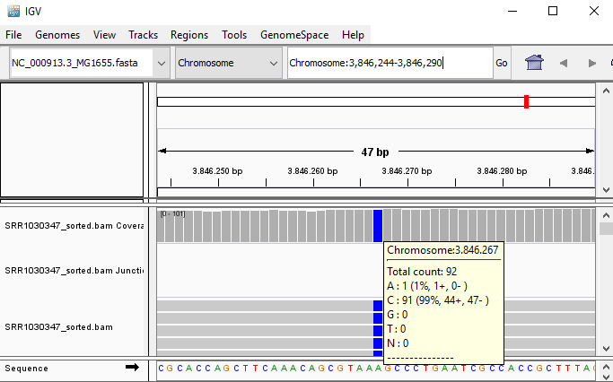

 

**QUESTION:** Paste in the interval window on the top these two positions separated by space: 'Chromosome:1-1000 Chromosome:4640500-4641652'. What can you see? 

Click Here to see the answer

You should see colors in some reads. These colors mean that the fragment lengths (estimated by the distances between the paired reads) are much significantly different to the mean fragment lengths. These are usually an indication of a structural variant (such as a large deletion). In this case, the estimated fragment length is the size of the genome! This is easy to understand if you realize this is a circular genome from a bacteria, and thus it is natural that a read aligning in the "beginning" of the genome may have its pair aligning in the "end" of the genome.
	
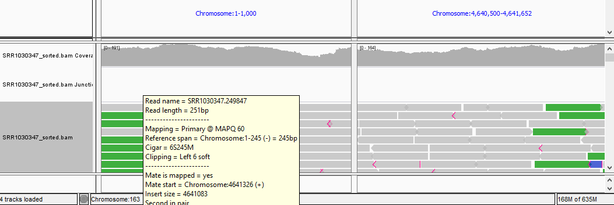 
	

 

**QUESTION:** Paste in the interval window on the top this position: 'Chromosome:3759212-3768438'. What can you see? 

Click Here to see the answer

You can see two regions where the reads are marked in white, both with slightly less coverage than the remaining regions marked in gray. The reads marked in white have a mapping quality of Q=0, which means the aligner does not know where these reads actually belong to. Most genomes (particularly mamallian genomes) contain areas of low complexity, composed mostly of repetitive sequences. In the case of short reads, sometimes these align to multiple regions in the genome equally well, making it impossible to know where the fragment came from. Longer reads are needed to overcome these difficulties, or in the absence of these, paired-end data can also be used. Some aligners (such as bwa) can use information on paired reads to help disambiguate some alignments. Information on paired reads is also added to the SAM file when proper aligners are used.

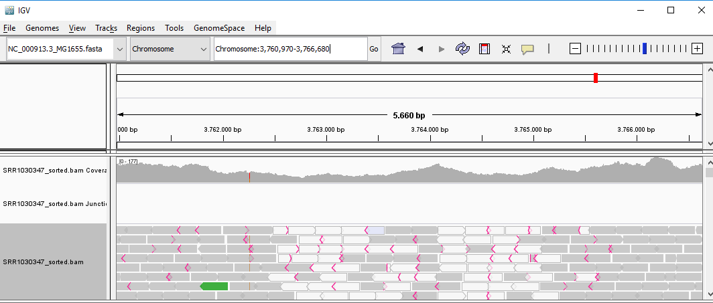 

 
 

**NOTE**: Turn on the green light when you're finished. Assess how well you achieve the learning outcome. For this, see how well you responded to the different questions during the activities and also make the following questions to yourself.

*: Did you broadly understand the different aspects to consider when evaluating the quality of your alignments?

* Could you use Qualimap to produce quality reports from your SAM/BAM alignments? 

* Did you broadly understand the information in a Qualimap report and use it to detect potential issues in your data? 

* Could you use IGV to visualize alignments in the SAM/BAM format? 
 
 

## <a id="LO5">5 - Broadly describe different HTS applications</a>

### <a id="LO5.1">5.1 - Variant detection in resequencing experiments</a>

After aligning reads against a reference genome, you can now see where and how the individual(s) genetic sequence differs from the reference genome. Using IGV, you have detected one mutation (a Single Nucleotide Polymorphism - SNP). To do this in a systematic way, there are specialized tools such as [GATK](https://www.broadinstitute.org/gatk/) and [freebayes](https://github.com/ekg/freebayes) that perform genotype attribution and detection of genetic variants from SAM/BAM alignment files.

**TASK** In the commandline, in the resequencing folder, type 'freebayes -f NC_000913.3_MG1655.fasta SRR1030347.alignment.sorted.bam > SRR1030347.alignment.vcf'. Open the resulting vcf file using a text editor or a spreadsheet.

The current standard for reporting genetic variants is the variat call format ([VCF](https://samtools.github.io/hts-specs/VCFv4.2.pdf)), which is a tabular text based format, where each line contains information about one putative variant detected by the software.

**QUESTION:** Are there variants in the vcf file you generated? What is the mutation with the highest confidence in the file? Note: quality is in the 4th column of the vcf file, in the Phred scale.

Click Here to see the answer

	Yes, there are several variants found, most of them with very low quality. There is only one variant with high quality (Q=2754.76), at position 3846267 (A>C). Do you recognize this mutation from before?

 

Sequencing and alignment errors cause many artefactual variants to appear. There are several filtering steps that need to be performed to minimize such errors.

**TASK** In the terminal, type 'freebayes -0 -f NC_000913.3_MG1655.fasta SRR1030347.alignment.sorted.bam > SRR1030347.alignment.high_quality.vcf'. Open the resulting vcf file using a text editor or a spreadsheet.

**QUESTION:** How many variants do you find now?

Click Here to see the answer

	Only the high quality variant is found now. The -0 parameter in freebayes applies common quality filters to select more confident variants.

 

After inferring trustworthy variants, their functional annotation (namely, of their impact) is usually performed by specialized tools such as the Variant Effect Predictor ([VEP](http://www.ensembl.org/info/docs/tools/vep/index.html)) that take into account information on the reference genome (namely, where are the genes).

**TASK** Go to the website [bacteria.ensembl.org](http://bacteria.ensembl.org). Select **Tools** and **Variant Effect Predictor**. Upload the vcf file (the last one you generated) and press "Run".

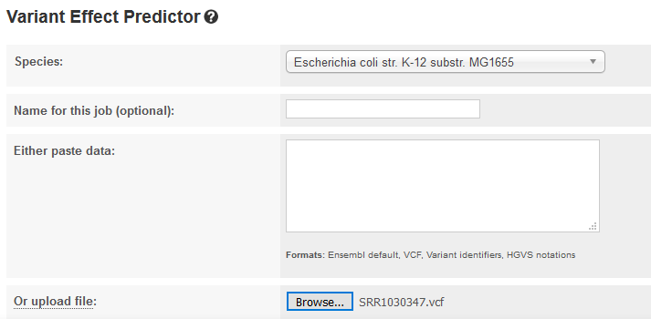 
 

**QUESTION:** What is the effect predicted by VEP of the A to C mutation we observed?

Click Here to see the answer

The SNP causes a missesse mutation of the gene uhpT, causing an aminoacid change from Phenylalanine to Valin at position 301 of the protein.

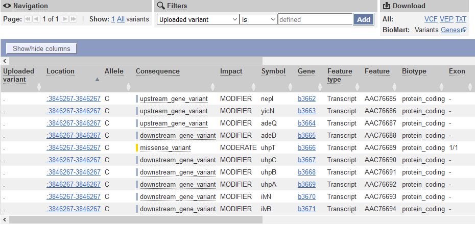 

 
 

Single nucleotide polymorphisms (SNP) are the variants that are most easily and commonly reported. Other variants pose different challenges and some are particularly difficult, such as the detection of transposable element activity. [Breseq](http://barricklab.org/twiki/bin/view/Lab/ToolsBacterialGenomeResequencing) is a software specialized in detecting several types of genomic events in short timescale evolutionary experiments in bacteria, including the movement of transposable elements. It produces user-friendly variant reports, including the functional annotation of variants that have been detected. This means it can predict not only which variants there are and where they are, but also their potential effects (in which genes, if they fall in a coding region, etc...).

**TASK**: Unzip the content of the file breseq_results.zip. Inside the folder, open the file index.html (using a web browser such as firefox). Identify the mutation in the uhpT gene that we saw before. Click on the read alignment (RA) evidence link to see the evidence that supports it.

**QUESTION:** What other mutations are found? What type of evidence is used for each of them?

Click Here to see the answer

There are 6 SNPs, 2 single base insertions, 1 small duplication and 2 large deletions. For SNPs and single base insertions only read alignment evidence is required. For deletions, missing coverage is necessary, as well as evidence for the new junctions that appear due to the deletion. For duplications there is the evidence of the new junctions.

In the bottom of the page we can see unassigned missing coverage and junction evidences. They are indications of possible variants, but for which not all criteria are met (eg. there is missing coverage, but no junctions to unequivocally identify a deletion).

 
 

**NOTE**: Turn on the green light when you're finished. Assess how well you achieve the learning outcome. For this, see how well you responded to the different questions during the activities and also make the following questions to yourself.

* Did you broadly understand the process of finding variants from alignments?

* Could you use freebayes to infer variants?

* Did you broadly understand the content of a VCF file?

* Did you broadly understand the process of inferring the effect of a variant?

* Could you use the VEP online tool to infer the effect of variations in a VCF file?

* Did you broadly understand the output of breseq and the challenge of finding different types of vriants?
 
 

### <a id="LO5.2">5.2 - Denovo genome assembly and annotation</a>

Another very common application of NGS, particularly for bacteria and virus without an assembled genome, is to obtain its complete genome from the assembly of million of short reads. This poses significant computational challenges and novel methods had to be devised to deal with the complexity. The most popular tools use [de-bruijn graphs](https://en.wikipedia.org/wiki/De_Bruijn_graph) to assemble millions of short reads. Although it is becoming much more feasible, assembly is still a very computer intensive process that needs to be run in powerful servers for most cases (particularly in longer and repeat-rich eukaryote genomes). [Spades](http://cab.spbu.ru/software/spades/) (mostly for bacteria) and [sga](https://github.com/jts/sga/wiki) (for longer eukaryote genomes) are examples of popular assemblers.

**TASK**: In the terminal, move to the resequencing folder and type 'spades.py -1 SRR1030347_1.fastq.interval.fq -2 SRR1030347_2.fastq.interval.fq  -o SRR1030347_spades'. After spades finishing successfully, there should be a folder SRR1030347_spades. Inside the folder you should have a scaffolds.fasta file.

**QUESTION**: What's in scaffolds.fasta file? 

Click Here to see the answer

As the name imples, this file contains the scaffolds that spades was able to assemble. Each scaffold is in a separate fasta entry, and represent the longest stretch of nucleotides that spades could connect together. Spades conveniently adds in the scaffold name (the fast entry) some extra information, such as its length and the mean coverage of the scaffold. This is very useful to know, since very short scaffolds or with very little coverage are likely to be artifacts and can be later removed. You may also have noticed the presence of a contigs.fasta file. Contigs are the longest strecthes of nucleotides (without gaps) that the assembler can connect together. Using paired-end information, the assembler may connect contigs together into longer scaffolds (adding gaps between contigs). In the case of single-end reads, the scaffolds file will be the same as the contigs file.

 

**QUESTION**: You sequenced DNA from one bacterial species using only single-end and short (100bp) sequencing data, but when doing a denovo assembly of the genome, instead of obtaining a single sequence for the full circular genome, you obtained several smaller sequences. What should be the main reason for this result? Will getting more sequences of the same type necessarily solve the problem ? 

Click Here to see the answer

The major limiting factor in the assembly process is the presence of repetitive sequences that are longer than the fragment length we can sequence. In this case, any sequence that is longer than 100bp and appears more than once in the genome will make it impossible for the assembler to unambiguously connect its borders, thus breaking the assembly into smaller contigs. Getting more small sequences will not solve the undelrying limitation, only getting longer reads, or/and using paired-end data.

 

When doing de novo genome assembly, we need to scaffold millions of pieces together. This process depends non-linearly on many factors. 

**QUESTION:** What factors may influence the genome assembly process?

Click Here to see the answer

  * Quality of Reads: sequences with more errors are likely to make the assembly process harder and error-prone.
  
  * Length of Reads: as we discussed before, the longer the reads, the more likely it is to have unambiguously overlapping fragments. If we can only have short reads (such as in illumina), we can simulate longer reads through paired-end sequencing. Nonetheless, even this is limited to 1-2kb. Methods such as mate-pair sequencing allow to simulate even longer fragments (5k, 20k or longer) by using paired-end reading with circularized fragments. Modern sequencing technologies such as PacBio or MinION allow the direct sequencing of very long reads (up to 100kb or more), although with a much higher error rate.
  
  * Number of Reads: The more we have usually the better, although there is always the limitation of the length we discussed before. Nonetheless, having too many reads may also cause trouble to the assembly. It is usually not recommended to have more than 200x global coverage, as spurious errors may appear frequently enough to make the assembler generate false contigs.

 

We usually want the assembled genome to be in as few pieces as possible, and that each piece is as large as possible. Of course, we also want the sequences to be as correct as possible. There are different measures we need to take into consideration to evaluate the quality of an assembly. [Quast](http://bioinf.spbau.ru/quast) is an example of a software that produces several measures to assess the quality of genome assemblies. Quast can test one (or several) genome assemblies (as fasta files). 

**TASK**: We have generated genome assemblies using diferent datasets to test different factors that affect the assembly process. Namely, we compared datasets with raw unprocessed reads (less_clean) and quality trimmed reads (more_clean). We have also compared datasets using single or paired reads. Another experiment compared single-end datasets of different read length (shorter_50bp, medium_100bp, longer_200bp). Finally, we compared the effect of using more reads (cov_200k, cov_1M, cov_2M). To compare all these assemblies (all derived from the same Escherichia coli sample), we used Quast to obtain different quality measures. In the assembly experiments folder, unzip the file quast_results.zip. Open the file report.html inside the folder quast_results.

**QUESTION:** What quality measures are produced by Quast?

Click Here to see the answer

Among several measures, a Quast report contains:

  * Number of contigs and their length. Ideally, we want to have one contig per chromosome (in this case, we would like to have only 1 contig), so we want as few and as long as possible, with the largest total length (sum of the length of all the contigs). A number that is most often used to measure the quality of an assembly is the N50, which is the length of the smallest contig such that at least 50% of the total length of the assembly is covered by contigs larger than that contig.
  
  * Statistics depending on a given reference genome. We may have a very long assembly, but it may still be wrong. To try to assess this, if we know that our sample should be relatively similar to a given known species (in our case Escherichia coli) then we can use that information to assess for quality. We can see how close if the total length of the assembly is to the length of the reference (Genome Fraction), how many bases are different from the assembly (mismatches) and how may structural variants we find (misassemblies). The argument is, if we are comparing different assemblies for the same sample, we want to minimize mismatches and misassemblies. Nonetheless, if we are doing an assembly, that's because we suspect the sample we are working with is sufficiently different from the reference. Therefore, these reference-based measures need to be taken with care.

 

**QUESTION:** What is the best assembly? Why?

Click Here to see the answer

The best overall assembly seems to be the paired assembly. It has less contigs and longest N50, covering most of the reference genome while keeping a low number of mismatches. The results indicate that cleaner reads, paired-end data, longer reads and more coverage usually give better assemblies. Nonetheless, there are always balances that need to be taken into consideration. For example, more_clean was obtained from less_clean by filtering, and thus contains less data. That's probably why, although we obtain a longer N50 and less mismatches, we lose some fraction of the genome coverage.

 

The genome assembly process generates a sequence of nucleotides in the form of a fasta file. Now we need to annotate the genome, namely to know where genes are and what are their possible functions. In bacteria, this is reasonably feasible, and there are already programs that allow a reasonably good quality annotation, such as [prokka](https://github.com/tseemann/prokka). In eukaryotes this process is much harder and requires multiple steps of validation. These programs identify the positions in the genome where genes are, as well as their sequence (RNA and protein). 

**TASK**: In a resequencing experiment, a set of reads did not align to the reference. These reads were assembled using spades, and the resulting assembly was annotated using prokka. Open and browse the assembly with IGV by loading the reference genome 'example_assembly.fasta'. Then, open the prokka annotation file 'example_assembly.prokka.gff' (containing the positions of the genes). You can also open in a text editor the files example_assembly.prokka.fasta (protein sequences) and example_assembly.prokka.gbk (Genbank file with the annotations).

**QUESTION:** How many genes where detected by prokka? What can be the origin of these sequences?

Click Here to see the answer

16 genes were detected. Most of them are hypothetical, but several seem to be related to antibiotic resistance. They could have originated from horizontal transfer from other organisms. Nonetheless, if you blast the original assembly sequences, you would find that this is a plasmid artificially inserted in the bacteria by the researcher.

 

**NOTE:** Annotating a genome allow us to use other measures to infer the quality of our assembly. Namely, we usually prefer assemblies where we can annotate more genes (assemblies that are too fragmented, or with incorrect sequence, have less annotated genes). One particular test relates to genes that are present in all species, where we prefer assemblies where we can detect as many of these genes as possible.
 
 

**NOTE**: Turn on the green light when you're finished. Assess how well you achieve the learning outcome. For this, see how well you responded to the different questions during the activities and also make the following questions to yourself.

* Did you broadly understand the process of genome assembly?

* Could you use spades to assemble contigs from short reads?

* Did you broadly understand different factors affecting the genome assembly process?

* Can you list different measures to asess the quality of a genome?

* Did you broadly understand the output of Quast to compare different assemblies?

* Did you broadly understand the process of genome annotation?
 
 

### <a id="LO5.3">5.3 - Transcriptomics using RNA-Seq</a>

Another very common application of NGS is to sample the transcriptome, much like gene expression microarrays. The main advantages of RNA Sequencing versus microarrays is a better signal-to-noise ratio and the ability to detect novel transcripts (something impossible with microarrays). Data processing is similar to genomic resequencing, although mRNA is usually spliced (in eukaryotes at least), and thus we need to use splice-aware aligners such as [Tophat](https://ccb.jhu.edu/software/tophat/index.shtml) and its successor [Hisat](http://ccb.jhu.edu/software/hisat2/index.shtml) to map short transcriptomic reads to a reference genome. These aligners are based on the burrows-wheeler aligners we discussed previously, but with extensions to deal with the possibility of spliced reads. Hisat was specifically designed to handle RNA-Seq data.

For this practical session, we will use data extracted from [Guilgur et al, 2014](https://elifesciences.org/content/3/e02181). In this Drosophila melanogaster dataset, we have two conditions, one control wild type (WT) and a mutant in the fandango gene (mut), with two replicates for each. To make it quick to run, we have extracted data for a very limited set of genes.

**NOTE**: Nowadays, it is more common to use 3 or more replicates for each condition. 

**TASK**: Upload all the files in the transcriptomics folder into Galaxy. Align the reads in the fastq files against the inbuilt Drosophila genome using Hisat2 in Galaxy (note: the fastq data is already of good quality). Use the inbuilt genome to avoid the indexing step. Optionally, you can also align using the genome you downloaded to see the difference in the time it takes. Finally, download all the BAM files you obtained in Galaxy, as well as their companion index bai files.

**TASK**: In IGV, load as genome the Drosophila melanogaster fasta in the transcriptomics folder. Next, load the BAM files for all the RNA samples. Finally, load the provided sample gtf file (not as genome).

**QUESTION:** Paste in the interval window on the top this position: 3L:15041314-15044195'. What can you see? 

Click Here to see the answer

The gene Rpnr12r (Fbgn0036465) is expressed in the mutant samples, but not in the wild type samples.
	
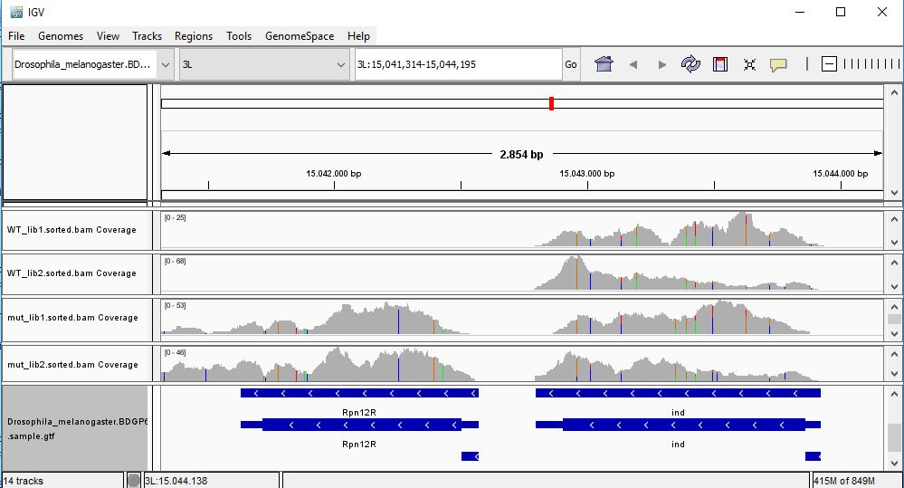 
	

 

**QUESTION:** Paste in the interval window on the top this position: X:20693985-20697646'. What can you see? 

Click Here to see the answer

The gene Run (FBgn0003300) is  slightly more expressed in the mutant samples. But the most noticeable difference is that the gene is poorly spliced in the mutant samples. This mutant affects a component of the spliceosome, and thus some of the genes are not spliced correctly, like this gene.
	
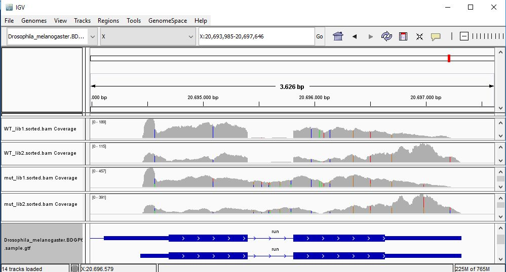 
	

 

**QUESTION:** Paste in the interval window on the top this position: X:5900729-5904706'. What can you see? 

Click Here to see the answer

Gene Act5c is very highly expressed in all samples.
	
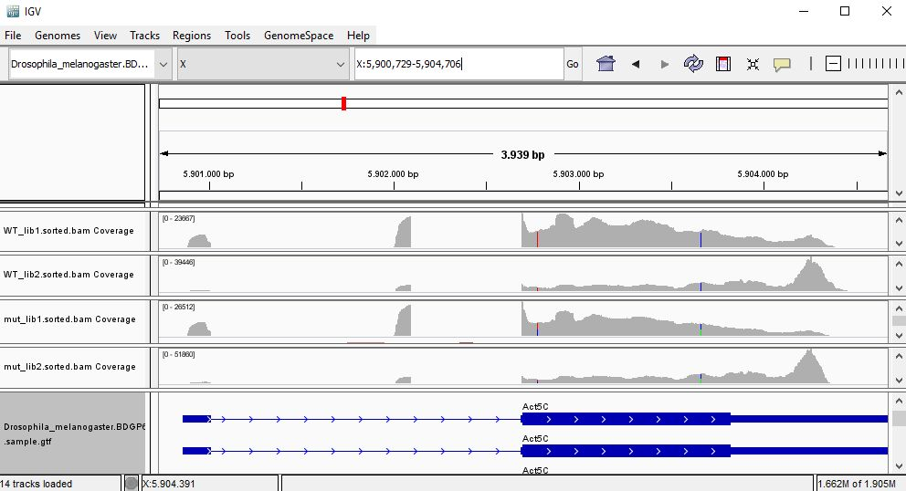 
	

 

**QUESTION:** In the gene Act5c samples the IGV plot seems more similar with regards to replicate than the genotype. What can be causing this? 

Click Here to see the answer

The gene Act5c is a ubiquitously expressed gene, so it is not differentially expressed between the two groups. Nonetheless, we can see that the distribution of reads is not entirely random, which is particularly noticeable in the samples for the second replicates, where reads tend to fall close to the end of the transcript. This RNA was purified using a process  captures the poly-A tails. An accumulation of RNA towards the end of the transcripts is probably due to a higher degradation of the RNA material when processing the samples for the second replicates (which were processed at a different time than the first replicates). This type of differences between replicates are also known as batch effects.

 

**QUESTION:** Would you be able to detect all of what you saw here using microarrays?

Click Here to see the answer

With microarrays, you would be able to detect that the gene Rpn12R is differentially expressed, or that the gene Act5c is highly expressed. Nonetheless, you would not be able to look for variants, and you would not be able to see that the gene Run has splicing problems. You also cannot look for genes (or alternative transcripts) that were not pre-specified in the array you used. Moreover, you would not be able to identify potential batch issues like what we noticed in the last example of gene Act5c.

 

We could see in IGC that gene Rpn12R is differentially expressed between the two groups. But like in the case of variant detection, we need to use specialized software to systematically detect differentially expressed genes. To perform differential expression analysis, one needs to count how many times a different transcript/gene is read. Popular tools to generate these counts from a SAM/BAM file include [htseq-count](http://www-huber.embl.de/users/anders/HTSeq/doc/overview.html) and [featurecounts](http://bioinf.wehi.edu.au/featureCounts/).

**TASK**: In Galaxy, use the tool htseq-counts to generate tables of counts for each sample. Use the generated BAM files, and the provided sample gtf file as inputs. Put stranded as 'No', and leave the rest as the default. Then press execute.

**QUESTION:** How many counts has the gene Rpn12R (FBgn0036465) in the differente samples?

Click Here to see the answer

The gene FBgn0036465 has 0 counts in WT_lib1, 1 in WT_lib2, 219 in mut_lib1 and 263 in mut_lib2.

 

**QUESTION:** You probably noticed the existence of a "no feature" table. What do you think is reported there?

Click Here to see the answer

The "no feature" table reports reads that were not assigned to genes, whether because they did not align, or they align in repetitive areas (not unique), because they not overlap a gene, or the software could not decide to which gene it belongs to (ambiguous).  

 

From these count files several methods can be then used to perform statistical tests. Given that sequencing data is based on discrete counts, most of the popular methods are based on derivations of the binomial distribution. Similarly to microarrays, there are many available tools to perform these analysis using the [R language](https://www.r-project.org/about.html) (such as [edger](https://bioconductor.org/packages/release/bioc/html/edgeR.html) and [DESeq](http://bioconductor.org/packages/release/bioc/html/DESeq.html)).

**TASK**: Use DESeq2 in Galaxy to calculate differential gene expression from the counts you generated. As factor use "Genotype", as factor level 1 use "mut", and as count files the 2 mut count tables generated before (the ones with the gene counts, not the "no feature" tables). As factor level 2 use WT and as count files the 2 WT count tables. Leave the rest as default and execute. 

**QUESTION:** How many genes were detected to be differentially expressed (padj<0.05)?

Click Here to see the answer

Only the gene FBgn0036465 (Rpn12R). The gene FBgn0003300 (run), despite having a bit more expression in the mutant, is not considered to be significantly differentially expressed.

 

**QUESTION:** What information is in the DESeq2 result table?

Click Here to see the answer

	* GeneID (The identifier of the gene - in this case the Flybase identifier)
	
	* Base Mean (The mean normalized counts of all the samples - a measure of how much is a gene expressed)
	
	* log2(FC) - log2 of the Fold Change (when positive, more expressed in one group than the other, and the reverse when negative)
	
	* StdErr - a measure of the confidence in the true value of the estimated log2(FC)
	
	* Wald-Stats - A value measuring how far is the observed log2(FC) from the 0 taking the StdErr into account.
	
	* P-value - A value measure how likely it is to obtain the observed log2(FC) by chance.
	
	* P-adj - The P-value corrected for multiple testing (the value that should be used in the end)
	

 

**QUESTION:** What information is in the DESeq2 plots?

Click Here to see the answer

	* PcA plot: Displays the samples through a projection that most explain the variation between samples.
	
	* Sample-to-Sample Distances: Like the previous plot, it displays how similar are the samples between each other.
	
	* Dispersion estimates - A plot displaying the approximations DESeq2 does to estimate the true log2(FC)
	
	* Histogram of P-values - As the name implies, it depicts the distribution of P-values for all genes.
	
	* MA-plot - plots the M (fold change) against the A (total expression) for all genes
	
	In this case, since there were only 8 genes, the plots displaying gene information were basically empty.
	

 
 

**NOTE**: Turn on the green light when you're finished. Assess how well you achieve the learning outcome. For this, see how well you responded to the different questions during the activities and also make the following questions to yourself.

* Could you use Hisat to align RNA-Seq reads against a reference genome?

* Could you use htseq-counts to generate gene counts from alignments and a reference annotation?

* Could you use DESeq2 to obtain differentially expressed genes?

* Did you broadly understand the process of differential gene expression analysis?
 
 

### <a id="LO5.4">5.4 - 16S Metagenomics</a>

In MetaGenomics, we don't sequence a single individual or clone, but a community of individuals of different species, usually with the goal of identifying the species that are present, and what are their relative abundances. As you can imagine, sequencing many genomes simultaneously (each of them present at different frequencies) is a very complex task, and techniques to do it efficiently are still an area of active research. Sequencing the DNA of all genomes simultaneously is also known as "Whole Shotgun Metagenomics".

Another simpler approach to do this is to sequence a single common locus with sufficient variability to allow distinguishing as many species as possible. 16S is a locus commonly used to sample bacterial communities. In this case, we don't need to assemble the reads, but to compare them against a reference database of 16S genes of known species. This is what software such as [Qiime](http://qiime.org/) and [mothur](https://www.mothur.org/) do. 

Since there are potentially many species not yet sequenced (particularly since most bacteria are unculturable), one may lose a lot of information if only trying to match a reference database. These programs also give the possibility of clustering some (or all) of the input sequences into Operational Taxonomical Units (OTU), which roughly translate into different species (usually an OTU is defined as a cluster of sequences with more than 97% similarity), thereby avoiding the possible gaps in the reference databases.

**TASK**: Unzip the file QIIME_core_diversity_report.zip. This contains the result of applying qiime into a dataset derived from [Batista et al. (2015)](https://www.nature.com/articles/ncomms9945). This data contais high-throughput 16S rRNA gene sequencing data of DNA extracted from faecal samples from two timepoints of a bacterial evolution experiment (day 0 and day 3) of wild-type mice where the mice from day 3 of experiment were treated with Streptomycin and subsequently colonized with Escherichia coli. Open the html file inside the folder you just extracted. 

**QUESTION:** Click on the link for the bar charts in the Taxonomic summary results (by Antibiotic Usage). What is the major difference between the untreated samples and the ones subjected to streptomycin?

Click Here to see the answer

The antibiotic removed most of the firmicute species, which were replaced by the Escherichia coli that was artificially inserted.

 

**QUESTION:** Click on the link for the rarefaction plots in the Alpha Diversity Results. Select different Metrics for the Category AntibioticUsage. What is the difference between the untreated samples and the ones subjected to streptomycin?

Click Here to see the answer

The antibiotic treated samples have much lower diversity (less bacterial taxa) than the untreated samples.

 

**QUESTION:** Click on the link for the rarefaction plots in the Alpha Diversity Results. Select different Metrics for the Category AntibioticUsage. What is the difference between the untreated samples and the ones subjected to streptomycin?

Click Here to see the answer

The antibiotic treated samples have much lower diversity (less bacterial taxa) than the untreated samples.

 

**QUESTION**: Click on the link for the PCoA plot (unweighted Unifrac) in the Beta Diversity results. Do you see clusters of samples forming? 

Click Here to see the answer

The antibiotic treated samples separate well from the untreated samples.

 

**QUESTION**: Click on the link for the Category Significance (AntibioticUsage). Which groups of OTUs are differentially present in untreated versus streptomycin treated (FDR<0.05)? Does it agree with what you saw before? 

Click Here to see the answer

Group significance tests which OTUs are significantly present in a group versus another (much like RNA-Seq differential gene expression). Many firmicute taxa are differentially present between the two groups, as well as Escherichia. This agrees with what we say before in the barplots.

 
 

**NOTE**: Turn on the green light when you're finished. Assess how well you achieve the learning outcome. For this, see how well you responded to the different questions during the activities and also make the following questions to yourself.

* Did you broadly understand the process of 16S metagenomics data analysis?

* Did you broadly understand the concept of alpha diversity (total diversity)?

* Did you broadly understand the concept of beta diversity (comparative diversity)?
 
 

### <a id="LO5.5">Epigenomics</a>

NGS can also be used to sequence specific regions of interest in the genome. An example of this are regions bound by transcription factors (TF). Using antibodies specific for a given TF, the bound DNA can be selectively extracted and sequenced. In this case, we are interested in knowing which areas of the genome are enriched in sequenced reads (loci bound by the TF). This technique is called ChIP-Seq (chromatin IP followed by sequencing).

We will look at some data from [(Myers et al., 2013)](http://journals.plos.org/plosgenetics/article?id=10.1371/journal.pgen.1003565). In this study, the authors generated a ChIP-Seq against the FNR transcription factor ('FNR_IP'), as well as a control pulldown without the antibody ('INPUT'). Certain programs, such as [MACS](https://github.com/taoliu/MACS), will compare the alignments of the TF ChIP-Seq against the alignments of the genomic control, and determine regions in the genome that are significantly enriched in the ChIP-Seq. To determine which genes were under direct control of FNR, the authors also generated RNA-Seq of a bacterial strain mutated in FNR (FNR-), and compared its gene expression against the wild type. 

**QUESTION**: Why do you need the control pulldown to analyse a ChIP-Seq experiment? 

Click Here to see the answer

Due to several factors, some parts of the genome are more frequently extracted than others. Therefore, if we want to know which parts of the genome are being enriched in a ChIP-Seq, we need to control for those intrinsic biases that are not related to the factor we are studying.

 

**TASK**: Open IGV, load as genome the file 'ecoli_NC_000913.2_MG1655.fa' in the epigenomics folder. Next, load the annotation file 'NC_000913.2_MG1655.gff', all the '*.bw' files (bigwig files are summary views of the alignments, representing average coverage along fixed-length intervals) and the 'MG1655_FNR_A_VS_INPUT_A_peaks.bed' file (this bed file contains the regions in the genome enriched in the FNR ChIP-Seq). The bigwig files contain summary views of the FNR ChIP-Seq, the genomic control, and the RNA-Seq datasets.

**QUESTION**: Look at the position for the gene dmsA (gi|49175990|ref|NC_000913.2|:938,182-944,626). What is the likely effect of FNR in that gene?

Click Here to see the answer

You can see that the gene dmsA seems to be less expressed in the FNR mutant than in the wild type. Moreover, the FNR ChIP-Seq seems enriched in the region just upstream of the dmsA gene. Therefore, it is likely that FNR is direcly and positively regulating the expression of dmsA.

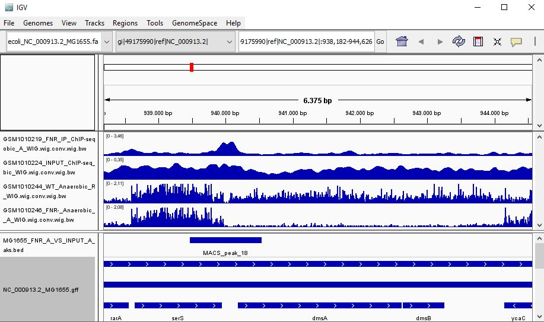 

 

**QUESTION**: Look at the position for the gene ndH (gi|49175990|ref|NC_000913.2|:1,163,308-1,168,612). What is the likely effect of FNR in that gene?

Click Here to see the answer

You can see that the gene ndH seems to be more expressed in the FNR mutant than in the wild type. Moreover, the FNR ChIP-Seq seems enriched in the region just upstream of the ndH gene. Therefore, it is likely that FNR is direcly and negatively regulating the expression of ndH.

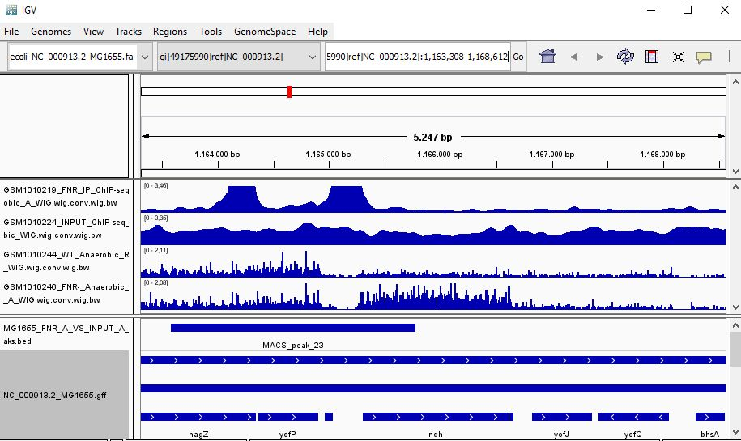 

 

Most often the term epigenetics is associated to DNA methylation. One popular technique to assess methylation is reduced representation bisulfite sequencing (RRBS), where GC-rich DNA is obtained and subjected to bisulfite treatment that converts unmethylated cytosines to uracil. After aligning the reads sequenced after bisulfite treatment with the reference genome, we can have an estimate of the percentage of methylation in those bases, by counting how many of the bases were converted.

**TASK**: Look at an example of RRBS 'ENCODE_example_BSSeq.bed' (open with a text editor, or use cat in the terminal, or in an excell spreadsheet). The last two columns tell you the total coverage and percentage of methylated bases, respectively.

**QUESTION**: What's the coverage and percentage of methylated bases at position chr1:1000170-1000171?

Click Here to see the answer

The coverage is 82, percentage of methylation (unconverted bases) is 20%.

 
 

**NOTE**: Turn on the green light when you're finished. Assess how well you achieve the learning outcome. For this, see how well you responded to the different questions during the activities and also make the following questions to yourself.

* Did you broadly understand the process of ChIP-Seq data analysis?

* Did you broadly understand the concept of integrating information from ChIP-Seq with RNA-Seq to infer possible regulatory events?

* Did you broadly understand the process of Reduced Representation Bisulfite Sequencing (RRBS)?
 
 
