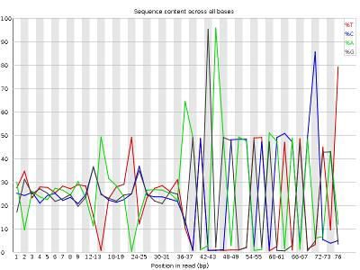
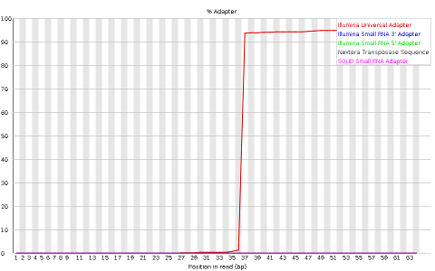
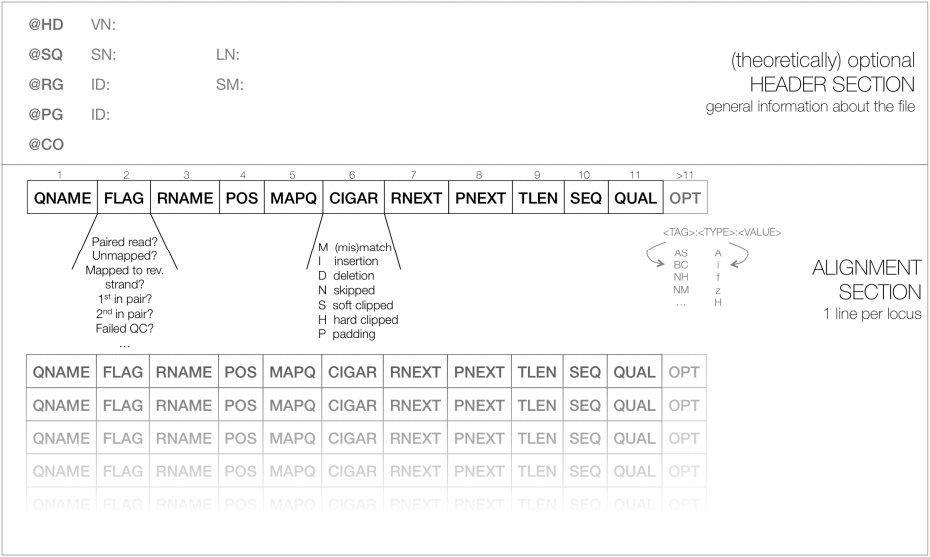

# ELB17S

## Learning Objectives: High Throughput Sequencing (HTS)
  .  Broadly describe the High Throughput Sequencing Workflow
  . Interpret and Manipulate raw sequencing data
  . Align HTS data against a genome
  . Visualize alignments
  . Broadly describe different HTS applications
 
## Learning Outcomes

### Broadly describe the High Throughput Sequencing Workflow
#### What are the usual steps in a sequencing experiment

### Interpret and Manipulate raw sequencing data
#### The FastQ file format
#### Use FastQC to analyse the quality of data in a fastq file.
#### Use Trimmomatic to improve the quality of data in a fastq file.

### Align HTS data against a genome
#### Use the BWA aligner to align HTS data against a genome
#### The SAM/BAM alignment format

### Visualize alignments
#### Use IGV to visualize the content of a BAM file

### Broadly describe different HTS applications
#### Variant detection in resequencing experiments
#### Denovo genome assembly and annotation
#### Transcriptomics using RNA-Seq
#### 16S Metagenomics
#### Epigenetics

## Introduction

[Sanger sequencing](https://en.wikipedia.org/wiki/Sanger_sequencing) brought about a technological revolution, as it allowed to directly read DNA molecules with relative ease and affordability. The [Human Genome Project](https://en.wikipedia.org/wiki/Human_Genome_Project) motivated further progress, leading to automated DNA-sequencing machines capable of sequencing up to 384 samples in a single batch using capillary electrophoresis. 

At the moment, the high throughput sequencing technology most often used (by far) is Illumina. Similarly to the Sanger method, it is also based on the addition of nucleotides specifically modified to block DNA strand elongation, where each nucleotide is marked with a different color. Unlike the Sanger method, where a single DNA molecule is "read" at a time, modern illumina machines allow reading up to millions of DNA molecules simultaneously.  

The following links are a good source of information regarding this sequencing technology:
* [Illumina Sequencing by Synthesis](https://www.youtube.com/watch?&v=fCd6B5HRaZ8).
* [Elaine Mardis talk on NGS](https://www.youtube.com/watch?v=v1DbcJD4Ry0).

### The FastQ file format

Results of sanger sequencing are usually fasta files (obtained from processing chromatograms). Most high-throughput sequencing machines output [fastq files](https://en.wikipedia.org/wiki/FASTQ_format), the “de facto” current standard in HTS. Like fasta, fastq files are simply text files, but where each block of information (a sequenced DNA fragment, or read) in this format is encoded as 4 lines:

	@read_identifier
	read_sequence
	+ separator line
	base_qualities
	
For example, here you have 8 lines of a fastq file, corresponding to 2 sequences:

	@HWI-M01876:76:000000000-AF16W:1:1101:10853:1000 1:N:0:CGTGACAGAT
	NTGTACTTCATCCGAAACTCGTGCTCATCTCTGCTCAGATCGGAAGAGCACACGTCTGAACTCCAGTCACCGTGAT
	+
	#8ABCFGGGFCEDCFGGGGGGGFFCGEFGGGGGGFGGGGGGGGDEFGGGGGGGGGGGGGGGGGFFFEGGGGGGGGF
	@HWI-M01876:76:000000000-AF16W:1:1101:16471:1000 1:N:0:CGTGAACTTG
	NTTCCAGATATTCGATGCATGTGCCGCTCCTGTCGGAGATCGGAAGAGCACACGTCTGAACTCCAGTCACCGTGAT
	+
	#8BCCGGGGGGGGGGGGGGGGGGGGGGGGGGGGGGGGGGGGGGGEGGGGFGGGGGGGGGGGGGGGGGGGGGGGGGG

Each base has a quality character associated with it, representing how confidently the machine identified (called) the base. The probability of error per base is given as a [Phred score](https://en.wikipedia.org/wiki/Phred_quality_score), calculated from an integer value (Q) derived from the quality character associated to the base. The probability of error is given by the Phred score using P(Q)=10^(-Q/10). Useful reference values of Q include:
* Q=10 - 90% accuracy (0.1 error)
* Q=20 - 99% accuracy (0.01 error)
* Q=30 - 99.9% accuracy (0.001 error)
* Q=40 - 99.99% accuracy (0.0001 error)

Although there's theoretically no limit, Q usually goes up to around 40 in recent illumina machines.

To obtain this Q value from the character associated to the quality of the base, we have to know that each character (such as '#') has an [ASCII](https://en.wikipedia.org/wiki/Phred_quality_score) decimal value associated (for example, '#' has a value of 35). The Q value of a character is the decimal value corresponding to the entry of that character in the ASCII table, subtracted by 33. For example Q('#') = 35 – 33.

**NOTE**: To understand why we need to subtract 33, we have to look into the ASCII table below. We can see that the first visible character ('!') has decimal value 33. This allows visual inspection of qualities.

Looking at the first read of our fastq example, we can see it starts with 'N' (unknown), with an associated quality character '#'. To known how confident the machine was in reading that base, we calculate:
- Q = 35 (ASCII decimal value of '#') - 33 (ASCII decimal value of '!') = 2
- p(2) = 10^(-2/10) = 63% (probability of error)

Given this probability of error, it is not surprising that the machine could not confidently say which base was in that position, and therefore placed an 'N' in that position. It is fairly common that in the first bases the machine is still calibrating, and sometimes there is less confidence in the called base.

**TASK**: Calculate the probability of error of the bases of the following read in the fastq format:

	@SRR022885.1 BI:080102_SL-XAR_0001_FC201E9AAXX:6:1:752:593/1
	CGTACCAATTATTCAACGTCGCCAGTTGCTTCATGT
	+
	IIIIIIIIII>IIIIIII@IIII.I+I>35I0I&+/

**NOTE**: Turn on the green light when you're finished. Don't hesitate to ask questions and to turn on the red light if you're having issues.

**NOTE**: Phred+33 (Sanger fastq) is the current standard format. Nonetheless, with older illumina data (before 2009) preferred to start at the character '@' (ASCII: 64) instead of '!'. This Phred+64 format is the old illumina fastq. Some tools (like FastQC) can infer the format, while in others you need to specify.

**QUESTION**: What is the probability of error of the first base of the read?

Click Here to see the answer

The base quality character is 'I', which corresponds to the decimal 73 in the ASCII table. Q = 73-33 = 40. P(40) = 10^(-40/10) = 10^-4 = 0.01% error.

 
**QUESTION**: What is the probability of error of the last base of the read?

Click Here to see the answer

The base quality character is '/', which corresponds to the decimal 47 in the ASCII table. Q = 47-33 = 14. P(14) = 10^(-14/10) = 10^-4 ~= 4% error.

### Quality Check of FastQ data

High Throughput Sequencing machines read thousands or millions of sequences in paralell. As you can imagine, this usually generates large fastq files, with millions of lines. Manually inspecting the quality of each read is out of the question. Specialized software has been developed to provide quality measures for fastq files generated by HTS machines. [FastQC](http://www.bioinformatics.babraham.ac.uk/projects/fastqc/) is a popular program to generate quality reports on fastq data. In fact, this is usually the first thing you should do once you receive a new dataset. FastQC reports provide a series of plots that allow the user to assess the overall quality of their raw data and detect potential biases and problems. 

Some plots indicate distribution of base qualities along the length of reads. At least for illumina data, on average the quality of each base tends to decrease along the length of the read. 

 

Other plots indicate biases in nucleotidic content of reads, either globally (such as %GC plots), or positionally. Global bias in nucleotidic content can be useful to search for signs of contaminants. On the other hand, positional bias are useful to detect presence of artefactual sequences in your reads such as adaptors. Another insight you may obtain from this information are potential biases in the preparation of your library. For example, random hexamer priming is actually not truly random, and preferentially selects certain sequences. The currently popular transposase-based enzymatic protocol, although reasonably random, is also not completely random, and you can see this through positional bias, particularly in the beginning of reads. The presence of adaptors is a relatively common event, and therefore specific plots exist to detect the presence of the most commonly used adaptors. Finally, the presence of repetitive sequences can also suggest contaminants, pcr artifacts, or other types of bias.

 

**NOTE**: Given the size of fastq files (usually in the order of Gb), they are most frequently compressed as fastq.gz files. In fact, most tools (such as FastQC) work directly with fastq.gz to reduce space.

**NOTE**: Some technologies (such as Illumina) allow reading a fragment from both ends. This so called paired-end data (compared to single-end) generates two synchronized fastq files, where each line on one file has a corresponding line on the other file for the same fragment (from the opposite end). In this case, the reverse read (R2) is usually of worse quality than the forward read (R1).

**TASK**: Open a terminal. type 'fastqc' and press enter. The graphical interface of FastQC should appear. Open the file MiSeq_76bp.fastq.gz inside of the folder fastq_examples. Look at the different plots you obtained. Next, open the file MiSeq_250bp.fastq.gz. Press the green button when you ran FastQC on both cases.

**QUESTION**: What information is in a FastQC report?

Click Here to see the answer

A FastQC report includes, among other things:
- Basic statistics of the fastq file, including number of reads and sequence length
- Per base sequence quality, displaying the boxplot distribution of the Phred Quality (Q) per base for all reads.
- Per sequence quality scores displaying the histogram of the mean quality (Q value) of the bases of each read, for all reads
- Per base sequence content, displaying the frequency of each nucleotide at each position of the read
- Per sequence GC content displaying the histogram of the GC frequency of each read, for all reads
- Sequence length distribution displaying the histogram of read lengths
- Sequence duplication levels displaying the histograms of the number of times reads appear with exactly the same sequence
- Overrepresented sequences (not necessarily complete reads) that appear more frequently than randomly expected
- Adapter content indicaring the frequency of sequences of know sequencing adaptors along the length of the reads

**QUESTION**: What are the main differences between the reports of both fastq files?

Click Here to see the answer

TODO TODO TODO

**TASK**: In a terminal window, go to the folder fastq_examples. Type 'fastqc *.fastq.gz' and press enter. What did you obtain? Inspect all files and compare the different technologies. Illumina machines generate shorter reads, usually all with the same length. Pacbio and nanopore generate (much) longer reads, with diverse read lengths, and of a poorer quality. Illumina generates many more reads, making both technologies complementary to each other (this will become clearer when we look at specific applications). Finally, you can also notice that, independently of the technology, the quality of base quality tends to decrease along the length of the read.

### Filtering and Trimming

As you may have noticed before, reads tend to lose quality towards their end, where there is a higher probability of erroneous bases being called. To avoid problems in subsequent analysis, you should remove bases with higher probability of error, usually by trimming poor quality bases from the end.

**TASK**: Manually remove the bases with Q<30 from the 3' end of the read you analysed before. Press Green when finished.

	@SRR022885.1 BI:080102_SL-XAR_0001_FC201E9AAXX:6:1:752:593/1
	CGTACCAATTATTCAACGTCGCCAGTTGCTTCATGT
	+
	IIIIIIIIII>IIIIIII@IIII.I+I>35I0I&+/

**Questions**: Does this remove all lower quality bases from the read? What other strategies you can imagine to filter your reads? Can you remove bases in the middle of reads? Why?
	
Like you have FastQC to automatically produce plots from fastq files, you also have software to filter low quality bases from fastq files. [Seqtk](https://github.com/lh3/seqtk) is a very simple tool that you can use to perform this filtering. 

**TASK**: In a terminal, go to folder fastq_examples. Type 'seqtk trimfq -q 0.01 MiSeq_250bp.fastq.gz > MiSeq_250bp.trimmed.fastq'. What is this command doing? Use fastQC to check the new fastq file that is created by this command. Press green when finished.

Most software for the analysis of HTS data is freely available to users. Nonetheless, they often require the use of the command line in a Unix-like environment (seqtk is one such case). User-friendly desktop software such as [CLC](https://www.qiagenbioinformatics.com/products/clc-genomics-workbench/) or [Ugene](http://ugene.net/) is available, but given the quick pace of developmpent in this area, they are constantly outdated. Moreover, even with better algorithms, HTS analysis must often be run in external servers due to the heavy computational requirements. One popular tool is [Galaxy](https://galaxyproject.org/), which allows even non-expert users to execute many different HTS analysis programs through a simple web interface.

**TASK**: In the web browser of the workstation you're using, open 'localhost'. You should see the Galaxy interface. Upload into Galaxy the files MiSeq_76bp.fastq.gz and MiSeq_250bp.fastq.gz (you should now see them on your history in the right panel). Run fastqc (by searching for this tool on the left panel) in both files. In galaxy again, run seqtk trimfq on the file MiSeq_250bp.fastq.gz with the same parameters as you used in the command line. 

As we saw before, sequencing machines (namely, the illumina ones) require that you add specific sequences (adaptors) to your DNA so that it can be sequenced. For many different reasons, such sequences may end up in your read, and you need to remove these artifacts from your sequences.

**Question**: Can you think of a reason why the adaptors can appear in your sequences? Take the sample MiSeq_76bp.fastq.gz as an example.

There are many programs to remove adaptors from your sequences, such as [cutadapt](https://cutadapt.readthedocs.org/en/stable/). To use them you need to know the adaptors that were used in your library preparation (eg. Illumina TruSeq). For this you need to ask the sequencing center that generated your data.

**TASK**: In Galaxy, use cutadapt to remove adaptors from MiSeq_76bp.fastq.gz. In this sample, we know that we used the illumina adaptor GTGACTGGAGTTCAGACGTGTGCTCTTCCGATCT, so try to remove this from the 3' end of reads and see the impact of the procedure using FastQC. For this, you need to insert a new adapter in 3', and in the source, select "Enter a custom sequence" (you don't need to add a name, just paste the sequence). What happened? Almost no read was affected. This is because what you get is a readthrough, so you actually have the reverse complement of the adaptor. Now, try the same procedure but with AGATCGGAAGAGCACACGTCTGAACTCCAGTCAC (reverse complement of the previous). Much better, no? Press green when you've completed the task.

[Trimmomatic](http://www.usadellab.org/cms/?page=trimmomatic) is a tool that performs both trimming of low quality reads, as well as adaptor removal. Moreover, it already contains a library of commonly used adaptors, so you don't need to know their sequence. As FastQC, it is a java program, so you can use it in any operating system (such as Windows and Mac), although unlike FastQC it needs to be run only using the commandline. 

**TASK**: In Galaxy, use Trimmomatic to remove low quality bases from MiSeq_250bp.fastq.gz, as well as the remainings of illumina Nextera adaptors that are still left in some of the reads (for this you need to select to perform an initial Illumina clip). Unlike seqtk, which always assume Phred scores (based on the "!" character), Trimmomatic requires you to guarantee that your file in the fastqsanger (Phred 33, instead of the fastqillumina 64). After you checked that this is the case in the FastQC report, you can edit the attributes of you file (the pencil mark) and change the datatype to fastqsanger. Press green when you've completed the task.

**Question**: What if you want to perform filtering and trimming on paired reads? Do you see a potential issue? What do these programs need to take into accout when dealing with paired data? 

## Applications of HTS

### Genomics - Resequencing

One of the most common applications of NGS is resequencing, where we want to genotype an individual from a species whose genome has already been assembled (a reference genome), such as the human genome, often with the goal to identify mutations that can explain a phenotype of interest.

#### Alignment to a reference genome

After obtaining millions of short reads, we need to align them to a (sometimes large) reference genome. To achieve this, novel, more efficient, alignment methods had to be developed. One popular method is based on the [burrows-wheeler transform](https://en.wikipedia.org/wiki/Burrows%E2%80%93Wheeler_transform) and the use of efficient data structures, of which [bwa](http://bio-bwa.sourceforge.net/) and [bowtie](http://bowtie-bio.sourceforge.net/index.shtml) are examples. They enable alignment of millions of reads in a few minutes, even in a laptop.

**NOTE:** Aligners based on the burrows-wheeler transform makes some assumptions to speed up the alignment process. Namely, they require the reference genome to be very similar to your sequenced DNA (less than 2-5% differences). Moreover, they are not optimal, and therefore sometimes make some mistakes.

**TASK** The first step of a burrows-wheeler aligner is to make an index from the fasta of the reference genome. open a terminal window, go to the folder resequencing and type 'bwa index NC_000913.3_MG1655.fasta'. Now, we can do the alignment against the created database. Type 'bwa mem NC_000913.3_MG1655.fasta SRR1030347_1.fastq.interval.fq SRR1030347_2.fastq.interval.fq > SRR1030347.alignment.sam'. Open the sam file with a text editor, and/or type in the terminal window 'head SRR1030347.alignment.sam'. To make it easier to analyse you can copy the contents and paste them in a spreadsheet program. Press green when finished.

**NOTE:** bwa mem is an update based on the original bwa to allow for aligning longer reads from newer illumina machines. It allows for split alignments, although it was not specifically designed for RNA-Seq (like we will see later in the course).

To store millions of alignments, researchers also had to develop new, more practical formats. The [Sequence Alignment/Map (SAM) format](https://samtools.github.io/hts-specs/SAMv1.pdf) is a tabular text file format, where each line contains information for one alignment.
 
 

SAM files are most often compressed as BAM (Binary SAM) files, to reduce space. These BAM files can then be indexed (do not confuse this indexing with the indexing of the reference genome) to allow direct access to alignments in any arbitrary region of the genome. Several tools only work with BAM files.

**TASK** Let's transform the SAM file into an indexed BAM file. In the same terminal window where you indexed the genome, type 'samtools view -Sb SRR1030347.alignment.sam > SRR1030347.alignment.bam'. To create the index, the alignments in the bam file need to be sorted by position. Type 'samtools sort SRR1030347.alignment.bam -o SRR1030347.alignment.sorted.bam'. Finally, we can create the index 'samtools index SRR1030347.alignment.sorted.bam'. Notice now the appearance of a companion file SRR1030347.alignment.sorted.bam.bai that contains the index. This file should always accompany its corresponding bam file.

**TASK** Let's do the whole process using galaxy. Upload the reference genome and the paired fastq files into Galaxy. Check their quality and perform any necessary filtering using trimmomatic or with any of the tools we saw before. Next, perform an alignment with bwa mem of the paired reads (you need to select the option of paired reads) against the reference genome (choose one from history). Next, download the bam file that was created. Also download the companion bai index file. Turn on the green light when you finished.

#### Visualizing alignment results

After generating alignments and obtaining a SAM/BAM file, how do I know this step went well? The same way as FastQC generates reports of fastq files to assess quality of raw data, there are programs that generate global reports on the quality of alignments. One popular tool for this is [qualimap](http://qualimap.bioinfo.cipf.es/).

**TASK** In the terminal window, type 'qualimap bamqc -bam SRR1030347.alignment.sorted.bam'. Open the report file generated by qualimap (there is a report html inside a new folder that qualimap creates).  Turn on the green light when finished.

**TASK**: Open the reports example_HiSeqBGI.pdf and example_MiSeq.pdf and compare the sequence coverage graphs and insert size histograms. 

**NOTE**: The way you check if the alignment step went well depends on your application. Usually, duplication levels higher than 20% are not a good sign (they're a sign of low input DNA and PCR artifacts) but again, depends on what you are sequencing and how much. Similarly, in the case of bacterial sequencing or targeted (eg. exonic) sequencing you expect >95% successful alignment, but if sequencing a full mamallian genome (with many duplicated areas) it may be normal to have as low as 70-80% alignment success. If you have to check the expected “quality” for your application.

You can also directly visualize the alignments using appropriate software such as [IGV](https://www.broadinstitute.org/igv/) or [Tablet](https://ics.hutton.ac.uk/tablet/). 

**TASK** In the terminal window, type 'igv'. Wait some time, and the IGV browser should appear. First, load the reference genome used for the alignment (load genome NC_000913.3_MG1655.fasta as file). You should see a chromosome of ~4.5Mb appearing, which is the genome size of Escherichia coli. Next, load the file SRR1030347.alignment.sorted.bam and/or the one you downloaded from Galaxy. You should see new tracks appearing in IGV when you load a file. Next, type in the interval window on the top this position: 'NC_000913.3:3846244-3846290'. What can you see here? Next, type 'NC_000913.3:1-1000 and NC_000913.3:4640500-4641652'. You should see colors in the reads. What do you think is the meaning of those colors? Finally, look in 'NC_000913.3:3759212-3768438'. Turn on the green light when finished.

**NOTE**: Most genomes (particularly mamallian genomes) contain areas of low complexity, composed mostly of repetitive sequences. In the case of short reads, sometimes these align to multiple regions in the genome equally well, making it impossible to know where the fragment came from. Longer reads are needed to overcome these difficulties, or in the absence of these, paired-end data can also be used. Some aligners (such as bwa) can use information on paired reads to help disambiguate some alignments. Information on paired reads is also added to the SAM file when proper aligners are used.

#### Detecting genetic variants

After aligning reads against a reference genome, you can now see where and how the individual(s) genetic sequence differs from the reference genome. Using IGV, you have detected one mutation. To do this in a systematic way, there are specialized tools such as [GATK](https://www.broadinstitute.org/gatk/) and [freebayes](https://github.com/ekg/freebayes) that perform genotype attribution and detection of genetic variants from SAM/BAM alignment files.

**TASK** In the commandline, type 'freebayes -f NC_000913.3_MG1655.fasta SRR1030347.alignment.sorted.bam > SRR1030347.alignment.vcf'. Open the resulting vcf file using a text editor or using cat in the terminal. Turn on the green light when finished.

The current standard for reporting genetic variants is the variat call format ([VCF](https://samtools.github.io/hts-specs/VCFv4.2.pdf)), which is a tabular text based format, where each line contains information about one putative variant detected by the software. After inferring variants, functional annotation of variants is usually performed by specialized tools such as the Variant Effect Predictor ([VEP](http://www.ensembl.org/info/docs/tools/vep/index.html)) that take into account information on the reference genome.

Single nucleotide polymorphisms (SNP) are the variants that are most easily and commonly reported. Other variants pose different challenges and some are particularly difficult, such as the detection of transposable element activity. [Breseq](http://barricklab.org/twiki/bin/view/Lab/ToolsBacterialGenomeResequencing) is a software specialized in detecting several types of genomic events in short timescale evolutionary experiments in bacteria, including transposable elements. It produces user-friendly variant reports, including the functional annotation of variants that have been detected. This means it can predict not only which variants there are and where they are, but also their potential effects (in which genes, if they fall in a coding region, etc...).

**TASK**: Open an example output file from breseq (index.html). Identify SNPs, deletions and movements of transposable elements. What type of evidence is required to safely detect such mutations? Turn on the green light when you're finished.

### Genomics - denovo genome assembly and annotation

Another very common application of NGS, particularly for bacteria and virus without an assembled genome, is to obtain its complete genome from the assembly of million of short reads. This poses significant computational challenges and novel methods had to be devised to deal with the complexity. The most popular tools use [de-bruijn graphs](https://en.wikipedia.org/wiki/De_Bruijn_graph) to assemble these millions of reads. Although it is becoming much more feasible, assembly is still a very computer intensive process that needs to be run in powerful servers for most cases (particularly in longer and repeat-rich eukaryote genomes). [Spades](http://cab.spbu.ru/software/spades/) (mostly for bacteria) and [sga](https://github.com/jts/sga/wiki) (for longer eukaryote genomes) are examples of popular assemblers.

**TASK**: Discuss the following: given that you know that most genomes contain repetitive sequences, do you think you can usually obtain a complete genome with a single NGS experiment sequencing only short reads (even for bacteria)? Do you think only sequencing more short reads can solve the issue?

**TASK**: In the terminal, type 'spades.py -1 SRR1030347_1.fastq.interval.fq -2 SRR1030347_2.fastq.interval.fq  -o SRR1030347_spades'. After spades finishing successfully, there should be a folder SRR1030347_spades. Inside you should have scaffolds fasta file.

When doing de novo genome assembly, we need to scaffold millions of pieces together. This process depends non-linearly on many factors. To assess how well the genome assembly process went, you usually want your assembled genome to be in as few pieces as possible, and that each piece is as large as possible. The usual N50, which is the size of the smallest contig that we need to include to have at least 50% of the assembled sequence (the higher the N50, the less fragmented is our assembly).

Nonetheless, this is not (and should not) be the only measure used to assess the quality of the genome. [Quast](http://bioinf.spbau.ru/quast) is an example of a software that produces several measures to assess genome assemblies.

**TASK**: Open the file report.html inside the folder quast_results. You can see differente measures comparing assemblies made with different datasets. What are the factors influencing genome assembly? In which way they influence assembly? What is the best assembly? Why? Turn on the green light when finished.

The genome assembly process generates a sequence of nucleotides. Now we need to annotate the genome, namely to know where genes are and what are their possible functions. In bacteria, this is reasonably feasible, and there are already programs that allow a reasonably good quality annotation, such as [prokka](https://github.com/tseemann/prokka). In eukaryotes this process is much harder and requires multiple steps of validation.

**TASK**: Open and browse an example assembly with IGV: load the reference genome 'example_assembly.fasta' and open the genome annotation 'example_assembly.prokka.gff'. How many genes where detected by prokka? Open the following files with a text editor: example_assembly.prokka.fasta and example_assembly.prokka.gbk. Turn on the green light when finished.

### Transcriptomics

Another very common application of NGS is to sample the transcriptome, much like gene expression microarrays. The main advantages of RNA Sequencing versus microarrays is a better signal-to-noise ratio and the ability to detect novel transcripts (something impossible with microarrays). Data processing is similar to genomic resequencing, although mRNA is usually spliced (in eukaryotes at least), and thus we need to use splice-aware aligners such as [Tophat](https://ccb.jhu.edu/software/tophat/index.shtml) and its successor [Hisat](http://ccb.jhu.edu/software/hisat2/index.shtml) to map short transcriptomic reads to a reference genome. These aligners are based on the burrows-wheeler aligners we discussed previously, but with extensions to deal with the possibility of spliced reads. Hisat was specifically designed to handle RNA-Seq data.

**TASK** Get the files from [here](https://github.com/dsobral/ADER17S/tree/master/material/guilgur). This contains data extracted from [Guilgur et al, 2014](https://elifesciences.org/content/3/e02181). In this Drosophila melanogaster dataset, we have two conditions (WT and mut), with two replicates for each (note that nowadays, it is more common to use 3 or more replicates). To make it quick to run, we have extracted data for a very limited set of genes. Next, obtain genomic fasta for Drosophila melanogaster from the Ensembl website: click on the Downloads tab on the top, then on Download data via FTP, finally search for Drosophila melanogaster and click on the fasta link for DNA data. Get the toplevel, non-masked compressed fasta file. Decompress the file. 

**TASK**: Upload all the files into Galaxy. Align the reads against the Drosophila genome using Hisat2 in Galaxy (note: the fastq data is already of good quality). Use the inbuilt genome to avoid the index step. Optionally, you can also align using the genome you downloaded to see the difference in time it takes. Finally, download all the BAM files (don't forget to download all the companion index bai files also).

**TASK**: In IGV, load as genome the Drosophila melanogaster fasta you downloaded previously. Also load the provided sample gtf file. Finally, load the BAM files for all the RNA samples. In IGV, look at position: 3L:15041314-15044195 (alternatively, look for the gene Rpn12R, or Fbgn0036465). What can you see? Next, look at position: X:20689286-20698941 (gene run, or FBgn0003300). What can you see? Finally, look at position: X:5898729-5908384 (gene Act5c, or FBgn0000042). What can you see (notice, in particular, the gene converage)? Turn on the green light when finished.

**Question**: Would you be able to detect all of what you saw here using microarrays? If not, what and why?

To perform differential expression analysis, one needs to count how many times a different transcript/gene is read. Popular tools to generate these counts from a SAM/BAM file include [htseq-count](http://www-huber.embl.de/users/anders/HTSeq/doc/overview.html) and [featurecounts](http://bioinf.wehi.edu.au/featureCounts/).

**TASK**: In Galaxy, use htseq-counts to generate tables of counts for each sample. Use the generated BAM files, and the provided sample gtf file. Put stranded as 'No', and leave the rest as the default. Then press execute.

From these count files several methods can be then used to perform statistical tests. Given that sequencing data is based on discrete counts, most of the popular methods are based on derivations of the binomial distribution. Similarly to microarrays, there are many available tools to perform these analysis using the [R language](https://www.r-project.org/about.html) (such as [edger](https://bioconductor.org/packages/release/bioc/html/edgeR.html) and [DESeq](http://bioconductor.org/packages/release/bioc/html/DESeq.html)).

**TASK**: Use DESeq2 in Galaxy to calculate differential gene expression. As factor use "Genotype", as factor level 1 use "mut", and as count files the 2 mut count tables generated before. As factor level 2 use WT and as count files the 2 WT count tables. Leave the rest as default and execute. Turn on the green light when finished.

**NOTE**: Several experiments can have different numbers of reads sequenced (for the same amount of RNA). Moreover, gene length also influences the number of counts. One common normalization is to transform counts into FPKM (fragments per kb per million aligned reads). Nonetheless this measure needs to be used with caution, particularly when comparing different loci.

### MetaGenomics 

In MetaGenomics, we don't sequence a single individual or clone, but a community of individuals of different species, usually with the goal of identifying the species that are present, and what are their relative abundances. As you can imagine, sequencing many genomes simultaneously (each of them present at different frequencies) is a very complex task, and techniques to do it efficiently are still an area of active research. 

Another simpler approach to do this is to sequence a single common locus with sufficient variability to allow distinguishing as many species as possible. 16S is a locus commonly used to sample bacterial communities. In this case, we don't need to assemble the reads, but to compare them against a reference database of 16S genes of known species. This is what software such as [Qiime](http://qiime.org/) and [mothur](https://www.mothur.org/) do. 

Since there are potentially many species not yet sequenced (particularly since most bacteria are unculturable), one may lose a lot of information if only trying to match a reference database. These programs also give the possibility of clustering some (or all) of the input sequences into Operational Taxonomical Units (OTU), which roughly translate into different species (usually an OTU is defined as a cluster of sequences with more than 97% similarity), thereby avoiding the possible gaps in the reference databases.

**TASK**: Unzip the file QIIME_core_diversity_report.zip. This contains the result of applying qiime into a dataset derived from [Batista et al. (2015)]. This data contais high-throughput 16S rRNA gene sequencing data of DNA extracted from faecal samples from two timepoints of a bacterial evolution experiment (day 0 and day 3) of wild-type mice where the mice from day 3 of experiment were treated with Streptomycin and subsequently colonized with Escherichia coli. Open the html file insie the folder you just extracted. If you click on the bar charts, you will see the species present in each sample and their relative frequency. What is the major difference between the untreated samples and the ones subjected to streptomycin? Turn on the green light when you're finished.

**TASK**: The alpha diversity measures species diversity within one sample or group of samples. Select the Alpha rarefaction plots, and see different metrics related to Antibiotic Usage. Also open the Alpha Diversity Boxplots. How do you interpret what do you see? Turn on the green light when you're finished.

**TASK**: The beta diversity measures a distance in diversity between samples or group of samples (how different are the communities). One way of visualizing those distances is through Principal Components plots. Press on the PCoA plot (unweighted Unifrac). Do you see clusters of samples forming? Group significance tests which OTUs are significantly present in a group versus another (much like RNA-Seq differential gene expression). Which groups of OTUs are differentially present in untreated versus streptomycin treated? Does it agree with what you saw before? Turn on the green light when you're finished.

### Epigenomics

NGS can also be used to sequence specific regions of interest in the genome. An example of this are regions bound by transcription factors (TF). Using antibodies specific for a TF, the bound DNA can be selectively extracted and sequenced. In this case, we are interested in knowing which areas of the genome are enriched in sequenced reads (loci bound by the TF). This technique is called ChIP-Seq (chromatin IP followed by sequencing).

**TASK**: Look at some data from (Myers et al., 2013): Open IGV, load as genome the file 'ecoli_NC_000913.2_MG1655.fa' in the epigenomics folder. Next, load the annotation file 'NC_000913.2_MG1655.gff', all the '*.bw' files (bigwig files are summary views of the alignments, representing average coverage along fixed-length intervals) and the 'MG1655_FNR_A_VS_INPUT_A_peaks.bed' file. Look at the following positions (examples from the paper): dmsA (gi|49175990|ref|NC_000913.2|:938,182-944,626) and ndH: (gi|49175990|ref|NC_000913.2|:1,163,308-1,168,612). To interpret the results, you need to know that 'FNR_IP' represents the DNA that comes with FNR antibody, 'INPUT' is what you obtain without antibody (note: why do you need this?). The 'peaks.bed' file contain regions of the genome enriched in DNA from the FNR antibody. Try to see if there is a correlation of the previous information with the WT RNA-Seq and the FNR mutant RNA-Seq. Turn on the green light when you're finished.

Most often the term epigenetics is associated to DNA methylation. One popular technique to assess methylation is reduced representation bisulfite sequencing (RRBS), where GC-rich DNA is obtained and subjected to bisulfite treatment that converts unmethylated cytosines to uracil. After aligning the reads sequenced  after bisulfite treatment with the reference genome, we can have an estimate of the percentage of methylation in those bases.

**TASK**: Look at an example of RRBS 'ENCODE_example_BSSeq.bed' (open with a text editor, or use cat in the terminal). The last two columns tell you the coverage and percentage of methylated bases relative to total bases sequenced at that position.
