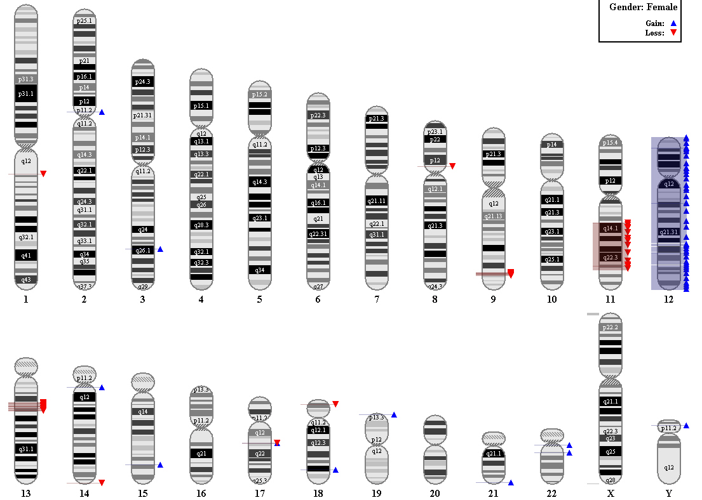

## Course Description
This is an **entry level** course aimed that those with a reasonable biological background but **no significant experience with bioinformatics**. The course is broadly based around a series of exercises in which a combination of simple analytical tools and reference to publicly available databases is applied to the investigation of a single human gene. The training manual for the course is comprised of detailed instructions for the tasks undertaken. Included are, questions (with answers) and discussion of and the interpretation of the results achieved.

Participants are asked to imagine an interest in the **disease aniridia**. Course exercises then provide extremely detailed instruction leading participants to discover the gene primarily associated with this disease and all that is interesting about that gene and its protein products.

This course will also provide a **soft introduction to Next Generation Sequencing (NGS) data analysis**. This part of the course aims at providing basic skills that are needed when one needs to process NGS data, such as evaluating data quality, trimming sequences, changing data formats, visualising data, etc. Then, participants will learn how to address a simple transcriptomics problem, stepwise, using open source bioinformatics tools.

## Target Audience
This course is intended for those wishing to investigate how they might begin to exploit the ever-expanding abundance of computing and data resources for researchers seeking help in using them. 

---

## Course Documentation

**Note -** All the datasets used for this training course is available in the following button. You need to unzip this file and follow the instructions throughout the documentation.

[**Download ELB18S Datasets**](https://github.com/GTPB/ELB18F/archive/data.zip){: .btn} <i>File Size: 185,9MB</i>

 

### Day 1
**1 -** [**Short introduction of what is Bioinformatics**](assets/00-Databases_Genes_Genomes.pdf)
        
         Discussion about the best approach for the definition of Bioinformatics

**2 -** [**Genome Databases and Tools**](assets/01-Databases_Practical.pdf)

         Investigating the gene(s) associated with the disease Aniridia      

 

### Day 2
**3 -** [**Graphical and Textual Pairwise Alignments**](assets/02-Pairwise_Alignment_Practical.pdf)

         Global vs. Sensitive Local Paiwise Sequence Comparison

**4 -** [**Databases Searching Methods (primarly blast)**](assets/03-Database_Searching_Practical.pdf)

         Database searching to determine gene structure
         Iterative database searching to discover and align sequence families (psi-blast & cobalt)

 

### Day 3
**5 -** [**Primer Design**](assets/04-Primer_Design_Practical.pdf)

         Primer design for the gene(s) responsible of Aniridia 

**6 -** [**Protein Structure**](assets/05-Structure_Prediction_Practical.pdf)

         Simple Protein Sequence Analysis
         Secondary Structure Prediction
         Protein Domain/Motifs Databases

**7 -** [**Multiple Sequence Alignment**](assets/06-Multiple_Sequence_Alignment.pdf)

         Use of various software tools and their differences between them

 

### Day 4
**8 -** [**Broadly describe the High Throughput Sequencing Workflow**](pages/L08.md)

         A small introduction about the common steps in most high throughput sequencing workflows
         
**9: Interpret and Manipulate raw sequencing data**
  + **9.1 -** [The FastQ file format](pages/L09.md)
  
               What information is in fastq files, and how is it organized
                
  + **9.2 -** [Use FastQC to analyse the quality of data in a fastq file](pages/L09.md/#LO9.2)
  
               Detect low-quality bases in the QC reports  
               Detect sequence bias and the possible presence of adaptors and other contaminants
               
  + **9.3 -** [Use Trimmomatic to improve the quality of data in a fastq file](pages/L09.md/#LO9.3)
               
               Use trimmomatic to filter/trim low-quality bases from your reads
               Remove adaptors (eg. illumina adaptors) from your reads
               Check results using FastQC on filtered data
               
**10: Align HTS data against a genome**
  + **10.1 -** [Use the BWA aligner to align HTS data against a genome](pages/L10.md)
  
              Know the challenges of aligning millions of short reads to a genome
              The  burrows-wheeler transform aligner method
                         
  + **10.2 -** [The SAM/BAM alignment format](pages/L10.md/#L10.2)
              
              What is the SAM/BAM format, its contents and the differences between them

 

### Day 5
**11: Visualize alignments**
  + **11.1 -** [Use Qualimap to assess the quality of alignments](pages/L11.md)
                
                Interpret general alignment statistics such as the percentage of aligned reads
                
  + **11.2 -** [Use IGV to visualize the content of a BAM file](pages/L11.md/#L11.2)
              
**12: Broadly describe different HTS applications**
  + **12.1 -** [Variant detection in resequencing experiments](pages/L12.md)
  
               Understand the process of finding variants from alignments
               Use freebayes to infer variants
               Use of VEP online tool to infer the impact of variants
  
  + **12.2 -** [Denovo genome assembly and annotation](pages/L12.md/#L12.2)
  
               How to obtain complete genome from the assembly of millions of short reads
               Understand the different factors that can affect the genome assembly process
  
  + **12.3 -** [Transcriptomics using RNA-Seq](pages/L12.md/#L12.3)
  
               Run hisat2 to align RNA-Seq reads against a reference genome
               Generate gene counts from alignments and a reference annotation through htseq-counts
               Use DESeq2 to calculate differential gene expression from the counts generated
               
  + **12.4 -** [16S Metagenomics](pages/L12.md/#L12.4)
  
  + **12.5 -** [Epigenetics](pages/L12.md/#L12.5)

---

### [Learning Objectives and Course Pre-requisites](pages/objectives_prerequisites.md)

### [Instructors](pages/instructors.md)
---

The source for this course webpage is [on github](https://github.com/GTPB/ELB18F).
